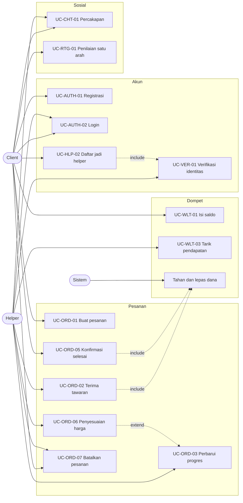

# Use Case Inventory dan Inventaris Layar

Status dokumen: `REVIEW` v0.1

## 1. Aktor

| ID | Aktor | Batasan |
| --- | --- | --- |
| ACT-01 | Client | Setiap akun terdaftar otomatis menjadi client |
| ACT-02 | Helper | Hanya akun yang lolos verifikasi dan mengaktifkan ketersediaan |
| ACT-03 | Sistem | Aktor untuk proses terjadwal seperti pelepasan dana otomatis dan pembatalan karena kehabisan waktu |
| ACT-04 | Admin operasional | Diperankan oleh Mentor. Dikonfirmasi 28 Agustus 2026 (DEC-07), mengakses lewat panel admin sungguhan di dalam sistem, bukan proses manual di luar sistem |

## 2. Daftar use case

| ID | Use Case | Aktor utama | FR terkait |
| --- | --- | --- | --- |
| UC-AUTH-01 | Registrasi akun | Client | FR-AUTH-001, 002, 003 |
| UC-AUTH-02 | Login | Client, Helper | FR-AUTH-004, 005, 007 |
| UC-AUTH-03 | Lupa kata sandi | Client, Helper | FR-AUTH-006 |
| UC-VER-01 | Mengajukan verifikasi identitas | Client | FR-VER-002, 003 |
| UC-HLP-01 | Mencari dan menyaring helper | Client | FR-HLP-002, 003, 004, 005 |
| UC-HLP-02 | Mendaftar menjadi helper | Client | FR-HLP-007, 008, FR-VER-002 |
| UC-HLP-03 | Mengatur ketersediaan | Helper | FR-HLP-009 |
| UC-ORD-01 | Membuat pesanan dengan harga estimasi | Client | FR-ORD-001, 002, 003 |
| UC-ORD-02 | Mengajukan tawaran harga | Helper | FR-ORD-003, 006, 016 |
| UC-ORD-02B | Memilih tawaran dari daftar helper | Client | FR-ORD-003B, 003C |
| UC-ORD-02C | Mengonfirmasi ketersediaan setelah terpilih | Helper | FR-ORD-006B |
| UC-ORD-03 | Memperbarui progres pekerjaan | Helper | FR-ORD-009, 013 |
| UC-ORD-04 | Memantau pesanan berjalan | Client | FR-ORD-007, 008 |
| UC-ORD-05 | Mengonfirmasi pesanan selesai | Client, Sistem | FR-ORD-010, 012 |
| UC-ORD-06 | Mengajukan penyesuaian harga talangan | Helper | FR-ORD-014 |
| UC-ORD-07 | Membatalkan pesanan | Client, Helper | FR-ORD-011 |
| UC-ORD-08 | Mengajukan sengketa, khusus pesanan kategori Delivery (DEC-10) | Client, Helper | FR-ORD-018 |
| UC-WLT-01 | Mengisi saldo | Client | FR-WLT-006 |
| UC-WLT-02 | Melihat riwayat mutasi saldo | Client, Helper | FR-WLT-005 |
| UC-WLT-03 | Menarik pendapatan | Helper | FR-WLT-007 |
| UC-CHT-01 | Berkirim pesan dalam pesanan | Client, Helper | FR-CHT-001, 002, 003 |
| UC-RTG-01 | Memberi penilaian (satu arah, Client ke Helper) | Client | FR-RTG-001 |
| UC-PRF-01 | Mengelola alamat tersimpan | Client | FR-PRF-002, 003 |
| UC-ADM-01 | Meninjau dan memutuskan pengajuan verifikasi identitas | Admin operasional | FR-ADM-003, 004 |
| UC-ADM-02 | Meninjau dan memutuskan sengketa | Admin operasional | FR-ADM-005, 006 |
| UC-ADM-03 | Melihat ringkasan agregat komisi | Admin operasional | FR-ADM-007 |

## 3. Peta relasi aktor dan use case

Catatan untuk SRS: diagram di atas dipakai sebagai bahan, tetapi versi resmi di SRS sebaiknya digambar dengan notasi UML use case yang benar memakai draw.io atau Lucidchart, lengkap dengan batas sistem serta relasi include dan extend.

## 4. Inventaris layar dari prototipe

Berikut layar yang terlihat pada video prototipe beserta elemen yang bisa diverifikasi.

| No | Layar | Elemen kunci yang terlihat | Use case terkait |
| --- | --- | --- | --- |
| 1 | Onboarding 1 | Judul tentang bantuan kecil sehari hari, indikator halaman, tombol lanjut, tautan lewati | UC-AUTH-01 |
| 2 | Onboarding 2 | Ikon perisai, pesan bahwa helper terverifikasi | UC-AUTH-01 |
| 3 | Onboarding 3 | Pesan tentang kebutuhan harian, tombol mulai | UC-AUTH-01 |
| 4 | Beranda | Lokasi aktif, sapaan nama, lonceng notifikasi berpenanda, kolom pencarian, banner voucher potongan pesanan pertama, enam kategori, kartu pesanan aktif, navigasi bawah empat tab | UC-HLP-01, UC-ORD-04 |
| 5 | Cari helper | Judul halaman, chip kategori, jumlah helper terdekat, pengurutan, kartu helper dengan rating, jumlah ulasan, jarak, tarif per jam, dan tag | UC-HLP-01 |
| 6 | Pelacakan | Label ETA langsung, peta dengan penanda helper dan tujuan, tahapan progres, kartu identitas helper dan kendaraan, nomor pesanan, total biaya, tombol selesai, tombol batalkan, tombol telepon | UC-ORD-04, UC-ORD-05, UC-ORD-07 |
| 7 | Percakapan | Gelembung pesan dua arah, balasan cepat, kolom ketik, lampiran | UC-CHT-01 |
| 8 | Daftar percakapan | Daftar lawan bicara, cuplikan pesan, waktu, penanda belum dibaca, termasuk kanal dukungan | UC-CHT-01 |
| 9 | Profil | Nama, kota, tanggal bergabung, lencana identitas terverifikasi, kartu dompet dengan saldo dan tombol isi saldo serta riwayat, alamat tersimpan, menu jadi helper, voucher, notifikasi | UC-PRF-01, UC-WLT-01, UC-HLP-02 |
| 10 | Ajakan jadi helper | Pesan penghasilan tambahan sesuai jadwal, tombol lanjut | UC-HLP-02 |
| 11 | Informasi pembayaran helper | Pencairan mingguan lewat dompet, rentang pendapatan bulanan, tombol ajukan | UC-WLT-03 |

## 5. Gap analysis prototipe

Ini daftar layar dan kondisi yang belum ada di prototipe tetapi wajib ada supaya sistem bisa jalan. Daftar ini yang saya bawa ke UI/UX Designer.

**Status per 28 Agustus 2026**: isi logika bisnis di bawah ini sudah dibahas dan sebagian dikonfirmasi lewat diskusi dengan UI/UX (lihat `draf-alur-untuk-sesi-uiux.md` untuk hasil finalnya per alur). Yang belum masuk ke sini adalah baris resmi baru di tabel bagian 4, karena itu menunggu nama layar dan elemen visual sungguhan dari hasil desain, bukan cuma konfirmasi lisan atau tertulis soal logikanya.

Alur akun belum tergambar sama sekali. Tidak ada layar registrasi, login, input OTP, maupun lupa kata sandi, padahal onboarding berakhir di tombol mulai. Ini pekerjaan pertama untuk desainer.

Alur pembuatan pesanan juga belum ada. Prototipe melompat dari daftar helper langsung ke pelacakan, jadi belum terlihat bagaimana client mengisi deskripsi tugas, memilih alamat, melihat rincian estimasi biaya, dan menekan konfirmasi bayar. Ini alur paling kritis karena di sinilah uang mulai ditahan.

Sisi helper belum tergambar sama sekali. Belum ada layar tawaran pesanan masuk dengan hitung mundur, layar pekerjaan berjalan dengan tombol perubahan status, layar unggah bukti penyelesaian, maupun dasbor pendapatan.

Kondisi tidak normal belum tergambar. Belum ada tampilan saat tidak ada helper tersedia, saat saldo tidak cukup, saat pembayaran gagal, saat pesanan dibatalkan helper, dan saat koneksi terputus di tengah pelacakan.

Alur penilaian dan sengketa sudah direvisi, lihat catatan status di atas. Penilaian sekarang satu arah saja dari Client ke Helper (DEC-09), dan sengketa dikhususkan hanya kategori Delivery (DEC-10).

Terakhir, verifikasi identitas hanya muncul sebagai lencana. Layar unggah kartu identitas, swafoto, status peninjauan, dan alasan penolakan belum ada.

Satu tambahan baru di luar tujuh poin di atas: layar pelacakan yang sudah ada di prototipe (poin peta dengan ETA langsung) perlu **digambar ulang**, dikonfirmasi 28 Agustus 2026 tidak ada perubahan dari keputusan `DEC-06` sebelumnya, tetap memakai visualisasi tahapan status, bukan peta real time.

## 6. Templat use case scenario

Semua use case ditulis memakai templat berikut supaya seragam antara SRS dan SDD. Isi di bawah sudah diperbarui 19 Agustus 2026 mengikuti `DEC-05`, model tawar harga dua arah. Skenario ini menggantikan model penerimaan tawaran tunggal yang sebelumnya jadi contoh di versi draf pertama.

Alur ini sekarang punya dua use case yang berurutan, bukan satu. Use case pertama adalah helper mengajukan tawaran, use case kedua adalah client memilih salah satu tawaran, dan itulah yang memicu penahanan dana.

### UC-ORD-02, mengajukan tawaran harga

| Bagian | Isi |
| --- | --- |
| Deskripsi | Helper yang berminat pada pesanan yang disiarkan mengajukan nominal harga yang dia mau kerjakan, boleh berbeda dari harga estimasi client |
| Aktor | Helper |
| Kode FR | FR-ORD-003, FR-ORD-006, FR-ORD-016 |
| Pra Kondisi | Helper berstatus terverifikasi, ketersediaan aktif, tidak sedang memegang pesanan aktif, pesanan masih dalam jendela penawaran 300 detik, dan helper bukan pembuat pesanan |
| Pasca Kondisi | Tawaran tercatat dan tampil di daftar tawaran milik client, belum ada dana yang berpindah |

Skenario utama

| Langkah | Aktor | Sistem |
| --- | --- | --- |
| 1 | Helper menerima notifikasi pesanan baru sesuai kategori dan radius | Menampilkan detail pesanan, jarak, harga estimasi client, dan sisa waktu jendela penawaran |
| 2 | Helper mengisi nominal tawaran dan menekan kirim | Memeriksa helper bukan pembuat pesanan dan jendela penawaran belum tertutup |
| 3 | | Menampilkan nominal bersih yang akan diterima helper dari tawaran tersebut sebelum konfirmasi akhir |
| 4 | Helper mengonfirmasi | Menyimpan tawaran dan mengirim notifikasi ke client bahwa ada tawaran baru |

Skenario alternatif dan eksepsi

| Kode | Kondisi | Perilaku sistem |
| --- | --- | --- |
| A1 | Helper mengajukan tawaran sama persis dengan harga estimasi client | Tawaran tetap diproses seperti biasa, tidak ada perlakuan khusus |
| E1 | Jendela penawaran sudah tertutup saat helper menekan kirim | Menolak dengan pesan bahwa pesanan sudah tidak menerima tawaran baru |
| E2 | Helper mencoba mengajukan tawaran pada pesanan miliknya sendiri | Menolak dengan kode SELF_ORDER_NOT_ALLOWED |

### UC-ORD-02B, memilih tawaran

| Bagian | Isi |
| --- | --- |
| Deskripsi | Client meninjau seluruh tawaran yang masuk dan memilih satu helper. Pilihan ini memicu konfirmasi ulang ke helper, lalu penahanan dana |
| Aktor | Client |
| Kode FR | FR-ORD-003B, FR-ORD-003C, FR-ORD-006B, FR-WLT-002 |
| Pra Kondisi | Ada minimal satu tawaran masuk pada pesanan tersebut |
| Pasca Kondisi | Status pesanan menjadi diterima, dana client tertahan sebesar nominal tawaran terpilih, tawaran lain ditandai tidak terpilih |

Skenario utama

| Langkah | Aktor | Sistem |
| --- | --- | --- |
| 1 | Client membuka daftar tawaran | Menampilkan setiap tawaran beserta profil helper, rating, jumlah pesanan selesai, dan nominal |
| 2 | Client memilih satu tawaran | Mengirim permintaan konfirmasi ke helper terpilih dengan batas waktu 60 detik |
| 3 | Helper mengonfirmasi masih tersedia | Memeriksa saldo client mencukupi nominal tawaran terpilih |
| 4 | | Menahan dana client sebesar nominal tawaran, mengubah status pesanan menjadi diterima |
| 5 | | Menandai seluruh tawaran lain pada pesanan itu sebagai tidak terpilih dan mengirim notifikasi penutupan ke helper yang tidak terpilih |
| 6 | | Menampilkan halaman pekerjaan berjalan pada helper terpilih dan halaman pelacakan pada client |

Skenario alternatif dan eksepsi

| Kode | Kondisi | Perilaku sistem |
| --- | --- | --- |
| E1 | Helper terpilih tidak merespons konfirmasi dalam 60 detik | Membatalkan pemilihan, mengembalikan client ke daftar tawaran untuk memilih helper lain |
| E2 | Helper terpilih sudah mengambil pesanan lain sebelum sempat konfirmasi | Menolak dengan kode konflik, mengembalikan client ke daftar tawaran |
| E3 | Saldo client tidak mencukupi saat penahanan dana | Membatalkan pemilihan, memberi tahu client untuk mengisi saldo, tawaran tetap tersimpan untuk dipilih ulang setelah saldo cukup |
| E4 | Permintaan pemilihan dikirim ulang karena jaringan buruk | Idempotency key yang sama mengembalikan hasil pemilihan pertama, tidak ada penahanan dana ganda |
