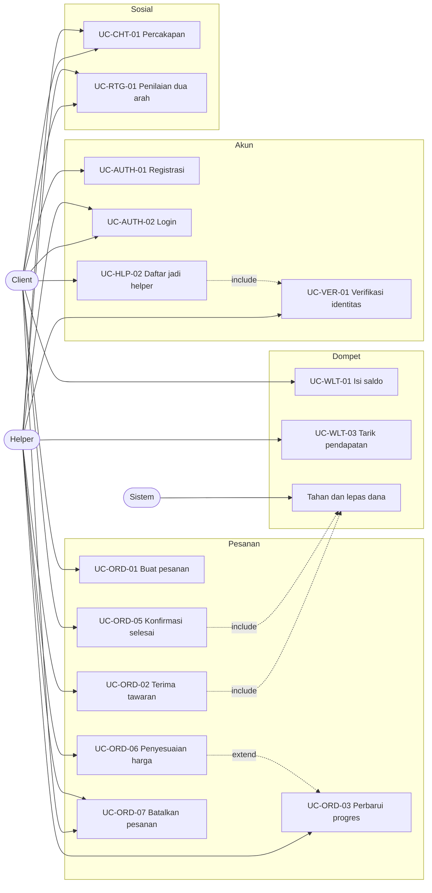

# Use Case Inventory dan Inventaris Layar

Status dokumen: `REVIEW` v0.1

## 1. Aktor

| ID | Aktor | Batasan |
| --- | --- | --- |
| ACT-01 | Client | Setiap akun terdaftar otomatis menjadi client |
| ACT-02 | Helper | Hanya akun yang lolos verifikasi dan mengaktifkan ketersediaan |
| ACT-03 | Sistem | Aktor untuk proses terjadwal seperti pelepasan dana otomatis dan pembatalan karena kehabisan waktu |
| ACT-04 | Admin operasional | Di luar aplikasi mobile, diakses lewat panel terpisah |

## 2. Daftar use case

| ID | Use Case | Aktor utama | FR terkait |
| --- | --- | --- | --- |
| UC-AUTH-01 | Registrasi akun | Client | FR-AUTH-001, 002, 003 |
| UC-AUTH-02 | Login | Client, Helper | FR-AUTH-004, 005, 007 |
| UC-AUTH-03 | Lupa kata sandi | Client, Helper | FR-AUTH-006 |
| UC-VER-01 | Mengajukan verifikasi identitas | Client | FR-VER-002, 003 |
| UC-HLP-01 | Mencari dan menyaring helper | Client | FR-HLP-002, 003, 004, 005 |
| UC-HLP-02 | Mendaftar menjadi helper | Client | FR-HLP-007, 008, FR-VER-002 |
| UC-HLP-03 | Mengatur ketersediaan | Helper | FR-HLP-009 |
| UC-ORD-01 | Membuat pesanan | Client | FR-ORD-001, 002, 003 |
| UC-ORD-02 | Menerima atau menolak tawaran pesanan | Helper | FR-ORD-004, 006, 016 |
| UC-ORD-03 | Memperbarui progres pekerjaan | Helper | FR-ORD-009, 013 |
| UC-ORD-04 | Memantau pesanan berjalan | Client | FR-ORD-007, 008 |
| UC-ORD-05 | Mengonfirmasi pesanan selesai | Client, Sistem | FR-ORD-010, 012 |
| UC-ORD-06 | Mengajukan penyesuaian harga talangan | Helper | FR-ORD-014 |
| UC-ORD-07 | Membatalkan pesanan | Client, Helper | FR-ORD-011 |
| UC-ORD-08 | Mengajukan sengketa | Client, Helper | FR-ORD-018 |
| UC-WLT-01 | Mengisi saldo | Client | FR-WLT-006 |
| UC-WLT-02 | Melihat riwayat mutasi saldo | Client, Helper | FR-WLT-005 |
| UC-WLT-03 | Menarik pendapatan | Helper | FR-WLT-007 |
| UC-CHT-01 | Berkirim pesan dalam pesanan | Client, Helper | FR-CHT-001, 002, 003 |
| UC-RTG-01 | Memberi penilaian dua arah | Client, Helper | FR-RTG-001, 002 |
| UC-PRF-01 | Mengelola alamat tersimpan | Client | FR-PRF-002, 003 |

## 3. Peta relasi aktor dan use case

Catatan untuk SRS: diagram di atas dipakai sebagai bahan, tetapi versi resmi di SRS akan digambar dengan notasi UML use case yang benar memakai draw.io atau Lucidchart, lengkap dengan batas sistem serta relasi include dan extend.

## 4. Inventaris layar dari prototipe

Berikut layar yang terlihat pada video prototipe beserta elemen yang bisa diverifikasi.

| No | Layar | Elemen kunci yang terlihat | Use case terkait |
| --- | --- | --- | --- |
| 1 | Onboarding 1 | Judul tentang bantuan kecil sehari hari, indikator halaman, tombol lanjut, tautan lewati | UC-AUTH-01 |
| 2 | Onboarding 2 | Ikon perisai, pesan bahwa helper terverifikasi | UC-AUTH-01 |
| 3 | Onboarding 3 | Pesan tentang kebutuhan harian, tombol mulai | UC-AUTH-01 |
| 4 | Beranda | Lokasi aktif, sapaan nama, lonceng notifikasi berpenanda, kolom pencarian, banner voucher potongan pesanan pertama, enam kategori, kartu pesanan aktif, navigasi bawah empat tab | UC-HLP-01, UC-ORD-04 |
| 5 | Cari helper | Judul halaman, chip kategori, jumlah helper terdekat, pengurutan, kartu helper dengan rating, jumlah ulasan, jarak, tarif per jam, dan tag | UC-HLP-01 |
| 6 | Pelacakan | Label ETA langsung, peta dengan penanda helper dan tujuan, tahapan progres, kartu identitas helper dan kendaraan, nomor pesanan, total biaya, tombol selesai, tombol batalkan, tombol telepon | UC-ORD-04, UC-ORD-05, UC-ORD-07 |
| 7 | Percakapan | Gelembung pesan dua arah, balasan cepat, kolom ketik, lampiran | UC-CHT-01 |
| 8 | Daftar percakapan | Daftar lawan bicara, cuplikan pesan, waktu, penanda belum dibaca, termasuk kanal dukungan | UC-CHT-01 |
| 9 | Profil | Nama, kota, tanggal bergabung, lencana identitas terverifikasi, kartu dompet dengan saldo dan tombol isi saldo serta riwayat, alamat tersimpan, menu jadi helper, voucher, notifikasi | UC-PRF-01, UC-WLT-01, UC-HLP-02 |
| 10 | Ajakan jadi helper | Pesan penghasilan tambahan sesuai jadwal, tombol lanjut | UC-HLP-02 |
| 11 | Informasi pembayaran helper | Pencairan mingguan lewat dompet, rentang pendapatan bulanan, tombol ajukan | UC-WLT-03 |

## 5. Gap analysis prototipe

Ini daftar layar dan kondisi yang belum ada di prototipe awal tetapi wajib ada supaya sistem bisa jalan. Daftar ini yang saya bawa ke UI/UX Designer.

Alur akun belum tergambar sama sekali. Tidak ada layar registrasi, login, input OTP, maupun lupa kata sandi, padahal onboarding berakhir di tombol mulai. Ini pekerjaan pertama untuk desainer.

Alur pembuatan pesanan juga belum ada. Prototipe melompat dari daftar helper langsung ke pelacakan, jadi belum terlihat bagaimana client mengisi deskripsi tugas, memilih alamat, melihat rincian estimasi biaya, dan menekan konfirmasi bayar. Ini alur paling kritis karena di sinilah uang mulai ditahan.

Sisi helper belum tergambar sama sekali. Belum ada layar tawaran pesanan masuk dengan hitung mundur, layar pekerjaan berjalan dengan tombol perubahan status, layar unggah bukti penyelesaian, maupun dasbor pendapatan.

Kondisi tidak normal belum tergambar. Belum ada tampilan saat tidak ada helper tersedia, saat saldo tidak cukup, saat pembayaran gagal, saat pesanan dibatalkan helper, dan saat koneksi terputus di tengah pelacakan.

Alur penilaian dan sengketa belum ada, padahal rating helper sudah tampil di kartu daftar helper. Artinya sumber angka itu belum punya layar penghasilnya.

Terakhir, verifikasi identitas hanya muncul sebagai lencana. Layar unggah kartu identitas, swafoto, status peninjauan, dan alasan penolakan belum ada.

## 6. Templat use case scenario

Semua use case ditulis memakai templat berikut supaya seragam antara SRS dan SDD. Contoh diisi dengan use case paling berisiko.

| Bagian | Isi |
| --- | --- |
| Nama Use Case | Menerima tawaran pesanan |
| ID | UC-ORD-02 |
| Deskripsi | Helper meninjau tawaran pesanan yang masuk dan memutuskan menerima atau melewatkannya. Penerimaan memicu penahanan dana client. |
| Aktor | Helper |
| Kode FR | FR-ORD-004, FR-ORD-006, FR-ORD-016, FR-WLT-002 |
| Pra Kondisi | Helper berstatus terverifikasi, ketersediaan aktif, tidak sedang memegang pesanan aktif, dan tawaran belum kedaluwarsa |
| Pasca Kondisi | Status pesanan menjadi diterima, dana client tertahan, client menerima notifikasi, tawaran ke helper lain dibatalkan |

Skenario utama

| Langkah | Aktor | Sistem |
| --- | --- | --- |
| 1 | Helper menerima notifikasi tawaran pesanan | Menampilkan detail pesanan, jarak, estimasi durasi, nominal bersih, dan hitung mundur 60 detik |
| 2 | Helper menekan tombol terima | Memeriksa bahwa tawaran masih berlaku dan helper bukan pembuat pesanan |
| 3 | | Memeriksa saldo client mencukupi lalu menahan dana |
| 4 | | Mengubah status pesanan menjadi diterima dan mencatat riwayat status |
| 5 | | Membatalkan tawaran yang sama pada helper lain |
| 6 | | Menampilkan halaman pekerjaan berjalan pada helper dan halaman pelacakan pada client |

Skenario alternatif dan eksepsi

| Kode | Kondisi | Perilaku sistem |
| --- | --- | --- |
| A1 | Helper melewatkan tawaran | Tawaran diteruskan ke helper berikutnya tanpa penalti |
| E1 | Hitung mundur habis sebelum helper menekan terima | Menampilkan pesan tawaran sudah tidak berlaku dan menutup layar tawaran |
| E2 | Helper lain sudah menerima lebih dulu | Menolak permintaan dengan kode konflik dan menampilkan pesan pesanan sudah diambil |
| E3 | Saldo client tidak mencukupi saat penahanan dana | Membatalkan penerimaan, mengembalikan pesanan ke antrean, dan memberi tahu client untuk mengisi saldo |
| E4 | Koneksi helper terputus setelah menekan terima | Permintaan dengan idempotency key yang sama diulang dan menghasilkan satu penerimaan saja |
