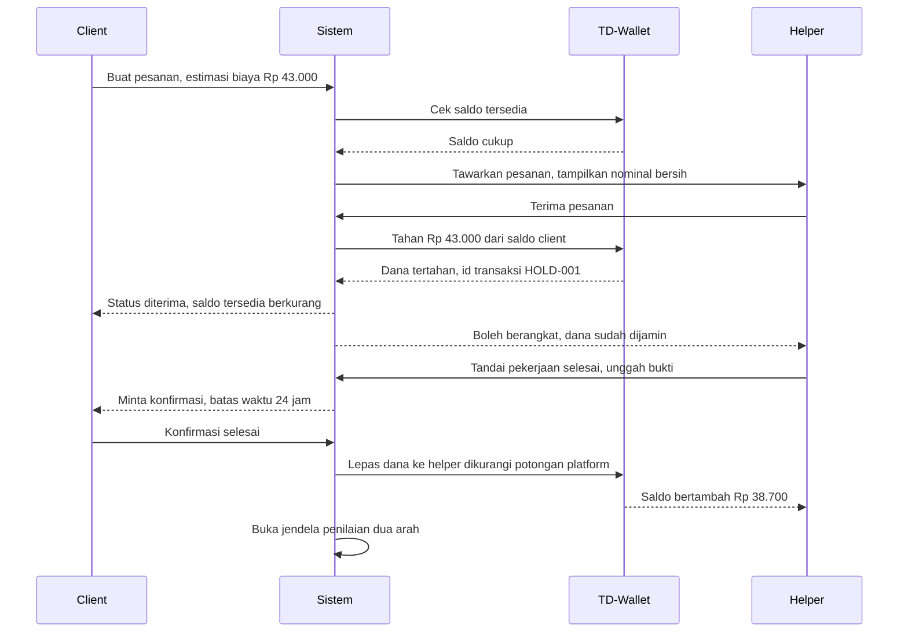
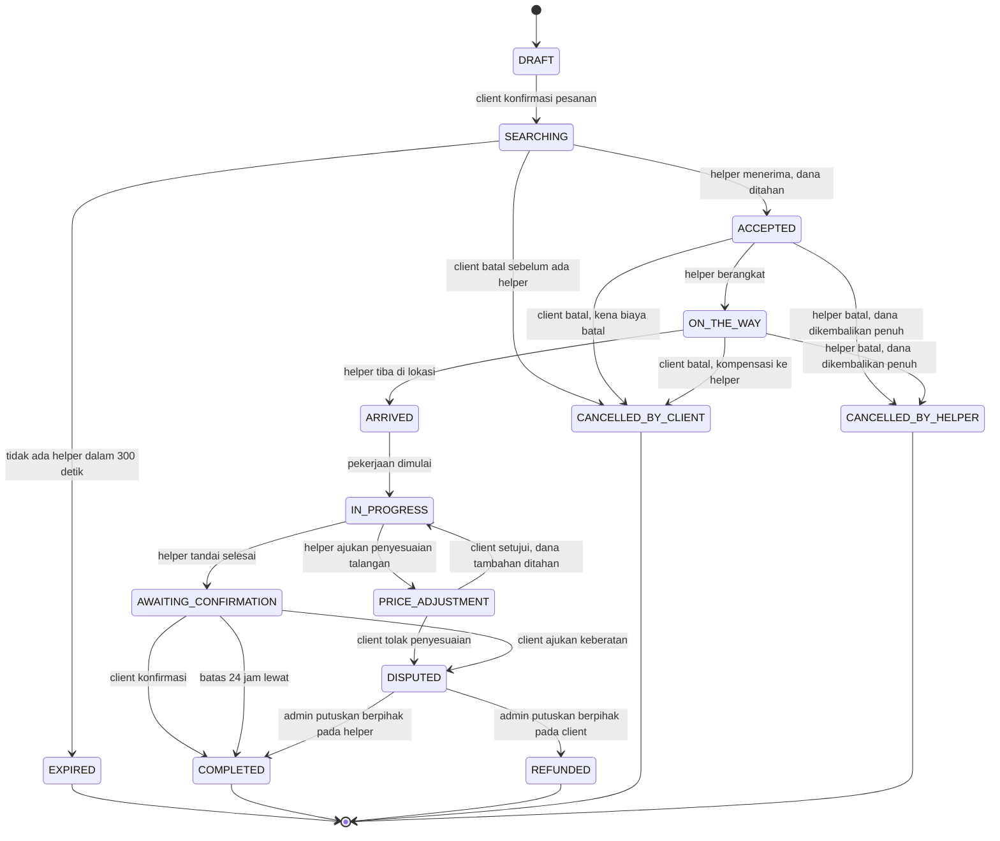

# Analisis Dua Peran dan Validasi Transaksi Dua Arah

Status dokumen: `REVIEW` v0.1. Dokumen ini menjawab pertanyaan yang diangkat tim tentang dua peran dan validasi transaksi. Isinya usulan SA yang perlu disetujui sebelum BE mulai membuat skema.

## 1. Rumusan masalah

Aplikasi ini bukan aplikasi satu arah seperti toko daring biasa. Ada dua orang yang sama sama punya kepentingan uang di satu transaksi, dan keduanya bisa dirugikan oleh pihak lain.

Dari sisi client, risikonya membayar tetapi pekerjaan tidak dikerjakan, dikerjakan asal asalan, atau helper menghilang setelah menerima pesanan. Dari sisi helper, risikonya sudah menempuh perjalanan atau sudah menalangi pembelian tetapi client membatalkan, tidak mengonfirmasi selesai, atau menghilang. Kalau desainnya keliru, salah satu pihak selalu menanggung risiko lebih besar dan aplikasi kehilangan kepercayaan.

Ada dua pertanyaan desain yang harus dijawab sebelum apa pun dibangun. Pertama, bagaimana satu orang bisa menjadi client dan helper tanpa membuat data identitas dan saldo menjadi kacau. Kedua, kapan tepatnya uang berpindah dan siapa yang memegangnya di antara waktu pesanan dibuat dan pekerjaan selesai.

## 2. Arsitektur akun untuk dua peran

Tiga opsi yang saya pertimbangkan.

| Opsi | Cara kerja | Kelebihan | Kekurangan |
| --- | --- | --- | --- |
| A. Dua akun terpisah | Satu orang mendaftar dua kali dengan email berbeda untuk jadi client dan helper | Pemisahan tegas, otorisasi sederhana | Identitas dan saldo terpecah, verifikasi identitas ganda, rekonsiliasi uang menyulitkan, pengalaman pengguna buruk |
| B. Satu akun satu peran aktif | Satu akun punya kolom peran yang nilainya client atau helper, diganti lewat pengaturan | Skema paling sederhana | Riwayat pesanan sebagai client hilang saat berganti peran, saldo ambigu milik peran mana, tidak sesuai prototipe yang menampilkan menu jadi helper di dalam profil client |
| C. Satu akun dua kapabilitas | Satu entitas `user` selalu punya kapabilitas client, ditambah `helper_profile` opsional yang aktif setelah verifikasi. Antarmuka menyediakan pertukaran konteks tampilan | Identitas dan dompet tunggal, riwayat utuh, sesuai prototipe, verifikasi cukup sekali | Butuh aturan otorisasi per aksi dan aturan pencegahan konflik kepentingan |

Rekomendasi saya opsi C, tercatat sebagai `DEC-01`. Alasannya bukan sekadar kerapian data. Dompet tunggal membuat pendapatan sebagai helper bisa langsung dipakai memesan sebagai client, dan itu justru inti cerita SDG 8 yang mau kita angkat, yaitu perputaran ekonomi di dalam komunitas.

Konsekuensi teknis yang harus dipatuhi.

Peran ditentukan per pesanan, bukan per akun. Setiap baris pesanan menyimpan `client_id` dan `helper_id`, dan otorisasi sebuah aksi diperiksa terhadap posisi pengguna pada pesanan itu, bukan terhadap kolom peran global. Pertanyaan yang dijawab sistem selalu berbentuk apakah pengguna ini adalah client dari pesanan ini, bukan apakah pengguna ini seorang client.

Pertukaran konteks tampilan hanya mengubah tampilan, bukan hak akses. Kalau helper sedang melihat mode client, dia tetap wajib menerima notifikasi pesanan aktif miliknya sebagai helper. Kehilangan notifikasi karena salah mode adalah bug yang mahal.

Larangan konflik kepentingan wajib ditegakkan di sisi server. Sistem menolak `helper_id` yang sama dengan `client_id` pada satu pesanan, ini `FR-ORD-016`. Selain itu, satu helper tidak boleh memegang lebih dari satu pesanan aktif, ini `FR-ORD-017`, dan seorang pengguna tidak boleh menjadi helper untuk pesanan yang dibuatnya lewat akun lain yang terdeteksi memakai nomor telepon atau perangkat yang sama.

## 3. Kapan uang berpindah

Ini jantung persoalan validasi transaksi dua arah. Usulan saya adalah pola penahanan dana, tercatat sebagai `DEC-02`.

Titik waktu penahanan dana bukan saat client menekan pesan, melainkan saat helper menekan terima. Alasannya, kalau ditahan saat client memesan, dana bisa tertahan lama tanpa ada helper yang mau, dan itu merugikan client. Sebaliknya kalau ditahan saat pekerjaan selesai, helper sudah terlanjur bekerja tanpa jaminan. Menahan pada saat penerimaan memberi kepastian dua arah sekaligus, karena helper baru berangkat setelah tahu dananya sudah tertahan.

Kalau client diam sampai batas 24 jam, sistem yang mengonfirmasi, ini `FR-ORD-012`. Tanpa aturan ini, helper bisa disandera oleh client yang sekadar malas menekan tombol.

## 4. State machine pesanan

Semua pihak harus sepakat pada satu daftar status. Tanpa ini, BE, Mobile, dan QA akan memakai kosakata berbeda dan integrasi akan berantakan.

Aturan yang mengikat untuk BE dan Mobile: transisi hanya sah kalau tergambar pada diagram ini, setiap transisi wajib dicatat di tabel `order_status_history` beserta pelaku dan waktu, dan tidak ada status yang boleh dilewati. Mobile tidak boleh menebak status berikutnya, harus selalu mengikuti status dari server.

## 5. Aturan pembatalan dan kompensasi

Ini bagian yang paling sering diperdebatkan, jadi angkanya saya usulkan eksplisit supaya bisa didebat dengan jelas dan bukan mengambang.

| Status saat dibatalkan | Pihak pembatal | Dana client | Kompensasi helper | Catatan |
| --- | --- | --- | --- | --- |
| SEARCHING | Client | Kembali penuh | Tidak ada | Belum ada helper yang dirugikan |
| ACCEPTED, kurang dari 120 detik sejak diterima | Client | Kembali penuh | Tidak ada | Masa tenggang niat baik |
| ACCEPTED, lebih dari 120 detik | Client | Kembali dikurangi biaya batal Rp 5.000 | Rp 5.000 | Helper sudah menolak tawaran lain |
| ON_THE_WAY | Client | Kembali dikurangi 30 persen dari tarif dasar | 30 persen tarif dasar | Helper sudah menempuh jarak |
| IN_PROGRESS | Client | Tidak bisa dibatalkan, harus lewat sengketa | Ditentukan admin | Mencegah penyalahgunaan |
| ACCEPTED atau ON_THE_WAY | Helper | Kembali penuh | Tidak ada, dan tercatat sebagai pembatalan helper | Tingkat pembatalan tinggi menurunkan prioritas helper di antrean tawaran |
| ON_THE_WAY, kategori Food run setelah barang dibeli | Helper | Kembali penuh dikurangi nilai talangan yang sudah terbukti | Nilai talangan | Butuh bukti struk |

Angka pada tabel ini berstatus `ASUMSI`. Tugas kita minggu depan adalah menyepakatinya di rapat tim, lalu menaikkan statusnya menjadi `CONFIRMED` dan menurunkannya ke `FR-ORD-011`.

## 6. Kasus khusus talangan pada Food run

Kategori Food run membuat arah uang menjadi benar benar dua arah, dan ini yang membedakan aplikasi ini dari aplikasi jasa biasa. Helper mengeluarkan uang sendiri untuk membeli barang, lalu uang itu harus kembali padanya bersama upah jasa.

Masalahnya, harga sesungguhnya sering berbeda dari estimasi. Mie ayam yang diperkirakan Rp 20.000 bisa jadi Rp 23.000. Kalau selisih ini tidak diatur, helper menanggung kerugian atau client merasa ditipu.

Usulan mekanisme. Client menetapkan batas talangan maksimal saat membuat pesanan, misalnya Rp 100.000. Sistem menahan dana sebesar upah jasa ditambah batas talangan tersebut, bukan hanya estimasi. Helper membeli, mengunggah foto struk, dan mengajukan nominal sesungguhnya. Kalau nominalnya di bawah atau sama dengan batas, sistem langsung menyesuaikan dan kelebihan penahanan dikembalikan tanpa perlu persetujuan client. Kalau melebihi batas, pesanan masuk ke status `PRICE_ADJUSTMENT` dan client harus menyetujui secara eksplisit sebelum helper melanjutkan.

Batas talangan maksimal juga sebaiknya dikaitkan dengan tingkat kepercayaan helper. Helper baru dengan kurang dari sepuluh pesanan selesai dibatasi Rp 50.000, sementara helper dengan rating di atas 4,5 dan lebih dari lima puluh pesanan selesai boleh sampai Rp 300.000. Ini melindungi client dari helper yang belum terbukti sekaligus memberi jalur naik kelas yang jelas bagi helper, sekali lagi sejalan dengan tema pekerjaan layak.

## 7. Daftar invarian sistem

Invarian adalah pernyataan yang harus selalu benar. Kalau salah satunya pernah salah, ada bug serius. Daftar ini saya serahkan ke BE sebagai bahan pengujian dan ke QA sebagai bahan skenario negatif.

| ID | Invarian |
| --- | --- |
| INV-01 | Saldo tersedia pengguna tidak pernah bernilai negatif |
| INV-02 | Jumlah saldo tersedia ditambah saldo tertahan selalu sama dengan hasil penjumlahan seluruh mutasi ledger pengguna tersebut |
| INV-03 | Satu pesanan hanya boleh punya satu penahanan dana yang aktif |
| INV-04 | Dana yang sudah dilepas ke helper tidak bisa dilepas ulang meskipun permintaan dikirim berkali kali |
| INV-05 | `client_id` dan `helper_id` pada satu pesanan tidak boleh sama |
| INV-06 | Satu helper hanya boleh punya satu pesanan berstatus antara ACCEPTED sampai AWAITING_CONFIRMATION |
| INV-07 | Setiap perubahan status pesanan menghasilkan tepat satu baris riwayat status |
| INV-08 | Penilaian hanya boleh dibuat untuk pesanan berstatus COMPLETED dan maksimal satu penilaian per pihak per pesanan |
| INV-09 | Total dana yang dilepas ke helper ditambah potongan platform selalu sama dengan dana yang ditahan untuk pesanan itu |
| INV-10 | Tidak ada pesanan berstatus ACCEPTED atau setelahnya tanpa catatan penahanan dana yang bersesuaian |

## 8. Edge case yang harus punya jawaban

| Kasus | Perilaku yang diharapkan |
| --- | --- |
| Dua helper menekan terima pada detik yang hampir bersamaan | Penguncian tingkat basis data pada baris pesanan, helper kedua menerima kode konflik dan pesan pesanan sudah diambil |
| Client menekan bayar dua kali karena jaringan lambat | Idempotency key sama menghasilkan satu transaksi, permintaan kedua mengembalikan hasil yang pertama |
| Saldo client habis dipakai pesanan lain di antara pengecekan dan penahanan | Penahanan dilakukan dalam satu transaksi basis data dengan pengecekan saldo, bukan dua langkah terpisah |
| Aplikasi helper mati saat status ON_THE_WAY | Status tetap di server, dipulihkan saat aplikasi dibuka lagi, tidak ada perubahan status otomatis dari sisi klien |
| Helper menandai selesai padahal belum mengerjakan | Client menolak konfirmasi dan mengajukan sengketa, dana tetap tertahan sampai keputusan admin |
| Client tidak pernah membuka aplikasi lagi setelah pekerjaan selesai | Konfirmasi otomatis setelah 24 jam, helper tetap dibayar |
| Helper membatalkan setelah membeli barang pada Food run | Dana talangan yang terbukti struk tetap dibayarkan, upah jasa tidak dibayarkan, tingkat pembatalan helper naik |
| Pengguna menghapus akun sementara masih ada pesanan berjalan | Penghapusan ditolak sampai seluruh pesanan mencapai status akhir dan saldo tertahan nol |
| Client mengisi saldo saat pesanan sedang menunggu karena saldo kurang | Sistem mencoba ulang penahanan dana secara otomatis satu kali setelah saldo masuk |
| Jam pada perangkat pengguna dimundurkan untuk mengakali batas waktu | Seluruh perhitungan waktu memakai waktu server, perangkat hanya menampilkan |

## 9. Bahan diskusi penting untuk Tim

Pertama, apakah dompet dalam lingkup lab berjalan dengan saldo simulasi atau perlu integrasi gerbang pembayaran sungguhan. Jawabannya menentukan besar kecilnya lingkup modul WLT.

Kedua, berapa besar potongan platform dan apakah ditanggung client, helper, atau dibagi. Ini memengaruhi rumus biaya dan tampilan rincian di dua sisi.

Ketiga, apakah pesanan dicocokkan dengan penawaran serentak ke banyak helper, pemilihan langsung oleh client, atau keduanya. Prototipe menampilkan daftar helper yang bisa dipilih, tetapi kartu pesanan aktif menyebut helper yang sudah ditugaskan, jadi keduanya mungkin dimaksudkan.

Keempat, apakah pelacakan memakai lokasi sungguhan lewat peta atau cukup simulasi perubahan status. Ini pertanyaan besar untuk beban kerja Mobile dan BE.

Kelima, siapa yang berperan sebagai admin operasional untuk verifikasi identitas dan sengketa, dan apakah panel admin masuk lingkup proyek atau cukup dijelaskan sebagai proses manual di luar sistem.
