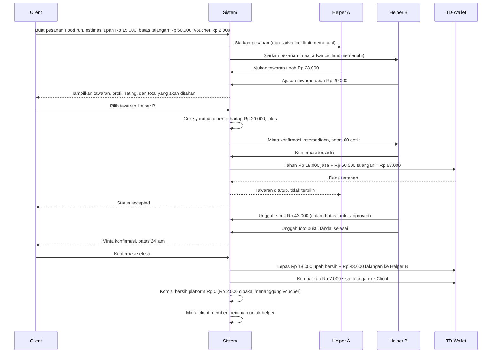
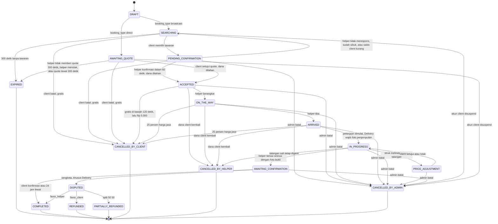

# Analisis Dua Peran dan Validasi Transaksi Dua Arah

Status dokumen: `REVIEW` v0.2, 28 September 2026. Dokumen ini menjawab pertanyaan yang diangkat tim tentang dua peran dan validasi transaksi. Bagian 1 dan 2 tidak berubah sejak v0.1. Bagian 3 sampai 9 direvisi mengikuti DEC-15 sampai DEC-24 di `10_notulen-sinkronisasi-erd-final.md`.

## 1. Rumusan masalah

Aplikasi ini bukan aplikasi satu arah seperti toko daring biasa. Ada dua orang yang sama sama punya kepentingan uang di satu transaksi, dan keduanya bisa dirugikan oleh pihak lain.

Dari sisi client, risikonya membayar tetapi pekerjaan tidak dikerjakan, dikerjakan asal asalan, atau helper menghilang setelah menerima pesanan. Dari sisi helper, risikonya sudah menempuh perjalanan atau sudah menalangi pembelian tetapi client membatalkan, tidak mengonfirmasi selesai, atau menghilang. Kalau desainnya keliru, salah satu pihak selalu menanggung risiko lebih besar dan aplikasi kehilangan kepercayaan.

Ada dua pertanyaan desain yang harus dijawab sebelum apa pun dibangun. Pertama, bagaimana satu orang bisa menjadi client dan helper tanpa membuat data identitas dan saldo menjadi kacau. Kedua, kapan tepatnya uang berpindah dan siapa yang memegangnya di antara waktu pesanan dibuat dan pekerjaan selesai.

## 2. Arsitektur akun untuk dua peran

Tiga opsi yang saya pertimbangkan.

| Opsi | Cara kerja | Kelebihan | Kekurangan |
| --- | --- | --- | --- |
| A. Dua akun terpisah | Satu orang mendaftar dua kali dengan email berbeda untuk jadi client dan helper | Pemisahan tegas, otorisasi sederhana | Identitas dan saldo terpecah, verifikasi identitas ganda, rekonsiliasi uang menyulitkan, pengalaman pengguna buruk |
| B. Satu akun satu peran aktif | Satu akun punya kolom peran yang nilainya client atau helper, diganti lewat pengaturan | Skema paling sederhana | Riwayat pesanan sebagai client hilang saat berganti peran, saldo ambigu milik peran mana, tidak sesuai prototipe yang menampilkan menu jadi helper di dalam profil client |
| C. Satu akun dua kapabilitas | Satu entitas `user` selalu punya kapabilitas client, ditambah `helper_profile` opsional yang aktif setelah verifikasi. Antarmuka menyediakan pertukaran konteks tampilan | Identitas dan dompet tunggal, riwayat utuh, sesuai prototipe, verifikasi cukup sekali | Butuh aturan otorisasi per aksi dan aturan pencegahan konflik kepentingan |

Rekomendasi saya opsi C, tercatat sebagai `DEC-01`. Alasannya bukan sekadar kerapian data. Dompet tunggal membuat pendapatan sebagai helper bisa langsung dipakai memesan sebagai client, dan itu justru inti cerita SDG 8 yang mau kita angkat, yaitu perputaran ekonomi di dalam komunitas.

Konsekuensi teknis yang harus dipatuhi.

Peran ditentukan per pesanan, bukan per akun. Setiap baris pesanan menyimpan `client_id` dan `helper_id`, dan otorisasi sebuah aksi diperiksa terhadap posisi pengguna pada pesanan itu, bukan terhadap kolom peran global. Pertanyaan yang dijawab sistem selalu berbentuk apakah pengguna ini adalah client dari pesanan ini, bukan apakah pengguna ini seorang client.

Pertukaran konteks tampilan hanya mengubah tampilan, bukan hak akses. Kalau helper sedang melihat mode client, dia tetap wajib menerima notifikasi pesanan aktif miliknya sebagai helper. Kehilangan notifikasi karena salah mode adalah bug yang mahal.

Larangan konflik kepentingan wajib ditegakkan di sisi server. Sistem menolak `helper_id` yang sama dengan `client_id` pada satu pesanan, ini `FR-ORD-016`. Selain itu, satu helper tidak boleh memegang lebih dari satu pesanan aktif, ini `FR-ORD-017`, dan seorang pengguna tidak boleh menjadi helper untuk pesanan yang dibuatnya lewat akun lain yang terdeteksi memakai nomor telepon atau perangkat yang sama.

## 3. Kapan uang berpindah

Bagian ini direvisi 28 September 2026 mengikuti DEC-15, DEC-17, dan DEC-21. Prinsip dari revisi 19 Agustus tetap berlaku: dana tidak ditahan saat pesanan dibuat, tetapi saat ada kepastian ganda, yaitu satu harga pasti dan satu helper pasti.

Titik penahanan dana sekarang berbeda menurut jalur pemesanan. Pada broadcast, dana ditahan saat helper yang client pilih mengonfirmasi ketersediaan dalam 60 detik. Pada direct booking, dana ditahan begitu client menyetujui quote, tanpa konfirmasi ulang, karena helper baru saja mengirim quote itu.

Nominal yang ditahan adalah `held_amount = service_client_charge + advance_limit`. `service_client_charge` adalah harga jasa dari tawaran terpilih dikurangi voucher. `advance_limit` adalah batas talangan yang client sediakan untuk Food run dan Laundry, bernilai nol untuk kategori lain. Rumus lengkap ada di `05_erd-draft.md` bagian 2.2.

Kalau client diam sampai 24 jam setelah helper menandai selesai, sistem yang mengonfirmasi (FR-ORD-012). Tanpa aturan ini, helper bisa disandera oleh client yang tidak menekan tombol.

## 4. State machine pesanan

Direvisi 28 September 2026. Perubahan dari versi sebelumnya: jalur direct booking lewat `AWAITING_QUOTE` (DEC-21), status `CANCELLED_BY_ADMIN` (DEC-22), status `PARTIALLY_REFUNDED` untuk hasil split (DEC-24), dan penghapusan transisi `PRICE_ADJUSTMENT --> DISPUTED` (DEC-20).

Aturan yang mengikat untuk BE dan Mobile: transisi hanya sah kalau tergambar pada diagram ini, setiap transisi dicatat di `order_status_history` beserta pelaku dan waktu, dan tidak ada status yang boleh dilewati. Mobile selalu mengikuti status dari server dan memakai daftar status berikutnya yang dikirim API-ORD-05 untuk menentukan tombol.

Tiga catatan untuk jalur yang baru.

Pertama, `PRICE_ADJUSTMENT` hanya muncul pada kategori bertalangan (Food run dan Laundry), dan hanya ketika struk melewati sisa batas talangan. Struk yang masih dalam batas langsung berstatus `auto_approved` tanpa mengubah status pesanan. Setelah client menyetujui atau menolak, pesanan selalu kembali ke `IN_PROGRESS`. Jalur ke `DISPUTED` dari sini sudah dihapus (DEC-20), sehingga inkonsistensi DEC-10 tertutup.

Kedua, `EXPIRED` pada direct booking bersifat akhir. Client yang ingin mencari helper lain menekan "Siarkan ke helper lain", dan sistem membuat pesanan broadcast baru dengan data yang sama (DEC-21).

Ketiga, `DISPUTED` tidak punya jalur ke `CANCELLED_BY_ADMIN`. Order yang sedang disengketakan diselesaikan lewat keputusan sengketa, bukan pembatalan (DEC-22).

## 5. Aturan pembatalan dan kompensasi

Final per DEC-19 dan DEC-22, menggantikan tabel usulan sebelumnya. "Harga jasa" berarti `total_amount`, yaitu harga dari tawaran atau quote terkonfirmasi, bukan harga estimasi client.

### 5.1 Pembatalan oleh client

| Status saat client membatalkan | Dana jasa client | Kompensasi helper | Voucher |
| --- | --- | --- | --- |
| `searching`, `awaiting_quote`, `pending_confirmation` | Belum ada dana tertahan | Tidak ada | Kembali |
| `accepted`, kurang dari 120 detik sejak `accepted_at` | Kembali penuh | Tidak ada | Kembali |
| `accepted`, 120 detik atau lebih | Kembali dikurangi Rp 5.000 | Rp 5.000 | Hangus |
| `on_the_way`, `arrived` | Kembali dikurangi 25 persen dari `total_amount`, dibulatkan ke bawah | 25 persen dari `total_amount` | Hangus |
| `in_progress`, `price_adjustment`, `awaiting_confirmation` | Client tidak bisa membatalkan sepihak | Tidak berlaku | Tidak berlaku |

Kompensasi masuk utuh ke helper, platform tidak mengambil komisi dari kompensasi. Kompensasi tidak pernah melebihi `service_client_charge` **(turunan SA)**. Batas talangan yang belum terpakai selalu kembali ke client.

### 5.2 Pembatalan oleh helper

Helper boleh membatalkan pada `accepted`, `on_the_way`, `arrived`, dan `in_progress`. Dana jasa client kembali penuh, helper tidak menerima upah, dan `helper_profile.cancelled_order_count` bertambah satu. Voucher client kembali **(turunan SA)**.

Kalau pada Food run atau Laundry sudah terjadi pembelian, helper hanya dijamin penggantian pengeluaran yang sah dan berada dalam batas talangan yang sudah disetujui, yaitu jumlah `price_adjustment.recognized_amount`. Rumusan ini sengaja dipilih tim (DEC-19) supaya tidak terbaca sebagai "semua struk pasti dibayar".

### 5.3 Pembatalan oleh admin

Admin boleh membatalkan order berstatus `pending_confirmation` sampai `awaiting_confirmation` dengan alasan wajib diisi (DEC-22). Dana jasa kembali penuh ke client, helper tidak menerima kompensasi pembatalan, dan talangan yang sah tetap diganti ke helper. Pilihan split tidak tersedia di sini. Order berstatus `disputed` tidak bisa dibatalkan admin dan harus diselesaikan lewat keputusan sengketa. Voucher client kembali **(turunan SA)**.

### 5.4 Contoh angka

| Kasus | held_amount | Ke helper | Kembali ke client |
| --- | --- | --- | --- |
| Food run jasa Rp 20.000, voucher Rp 2.000, batas Rp 50.000, client batal pada `accepted` setelah 3 menit | 68.000 | 5.000 | 63.000 |
| Delivery jasa Rp 40.000, voucher Rp 4.000, client batal pada `on_the_way` | 36.000 | 10.000 | 26.000 |
| Food run jasa Rp 20.000, voucher Rp 2.000, batas Rp 50.000, sudah belanja sah Rp 40.000, admin batal | 68.000 | 40.000 | 28.000 |

## 6. Talangan pada Food run dan Laundry

Direvisi 28 September 2026 mengikuti DEC-17, DEC-18, dan DEC-20. Model ini berlaku untuk Food run dan Laundry. Laundry memakai model jemput, bayar dengan talangan di penyedia laundry, lalu antar kembali. Helper tidak mencuci sendiri.

Upah jasa dan uang belanja dipisah. Helper menawar upah jasa saja. Client menyediakan batas talangan saat membuat pesanan. Komisi platform 10 persen hanya dihitung dari upah jasa, karena uang belanja adalah uang milik client yang helper bawakan, bukan pendapatan helper.

Alurnya sebagai berikut. Sistem menahan upah jasa setelah voucher ditambah batas talangan. Helper berbelanja lalu mengunggah struk. Kalau total struk masih dalam batas, sistem langsung mengakuinya sebagai `auto_approved`. Kalau melewati batas, pesanan masuk `price_adjustment` dan client harus menyetujui. Persetujuan menahan dana tambahan sebesar kelebihannya. Penolakan mengembalikan pesanan ke `in_progress`, dan helper hanya berhak atas penggantian sampai batas lama. Helper lalu memilih melanjutkan dalam batas lama atau membatalkan. Sisa batas yang tidak terpakai kembali ke client saat settlement.

Belanja di atas batas talangan tidak dijamin selama client belum menyetujuinya (DEC-20). Karena itu aplikasi helper perlu mendorong helper mengajukan penyesuaian sebelum membayar di kasir kalau perkiraan belanja akan melewati batas. Ini catatan untuk UI/UX.

Satu pesanan boleh punya banyak struk, tetapi hanya satu struk berstatus `pending` pada satu waktu (DEC-14 nomor 2). Seluruh struk tetap tercatat untuk audit.

Batas talangan terkait tingkat kepercayaan helper lewat `helper_profile.max_advance_limit`. Pesanan yang batas talangannya lebih besar dari `max_advance_limit` seorang helper tidak disiarkan ke helper itu, dan tawaran darinya ditolak (DEC-17). Usulan lama soal tingkatan batas (Rp 50.000 untuk helper baru, sampai Rp 300.000 untuk helper berpengalaman) masih berstatus `ASUMSI` dan belum dibahas tim.

## 7. Daftar invarian sistem

Direvisi 28 September 2026. INV-03 dan INV-09 disesuaikan dengan empat konsep uang (DEC-15), INV-11 sampai INV-15 baru.

| ID | Invarian |
| --- | --- |
| INV-01 | Saldo tersedia dan saldo tertahan pengguna tidak pernah bernilai negatif |
| INV-02 | Jumlah saldo tersedia ditambah saldo tertahan selalu sama dengan hasil penjumlahan seluruh mutasi ledger pengguna tersebut |
| INV-03 | Jumlah seluruh mutasi `hold` untuk satu pesanan selalu sama dengan `orders.held_amount` |
| INV-04 | Dana yang sudah dilepas ke helper tidak bisa dilepas ulang meskipun permintaan dikirim berkali kali |
| INV-05 | `client_id` dan user pemilik `helper_id` pada satu pesanan tidak boleh sama |
| INV-06 | Satu helper hanya boleh punya satu pesanan berstatus antara `accepted` sampai `awaiting_confirmation` |
| INV-07 | Setiap perubahan status pesanan menghasilkan tepat satu baris riwayat status |
| INV-08 | Penilaian hanya boleh dibuat untuk pesanan berstatus `completed` dan maksimal satu penilaian per pesanan, dari client ke helper |
| INV-09 | Pada setiap pesanan yang mencapai status akhir, dana ke helper ditambah komisi bersih platform ditambah dana kembali ke client sama dengan `held_amount` |
| INV-10 | Tidak ada pesanan berstatus `accepted` atau setelahnya tanpa catatan penahanan dana yang bersesuaian |
| INV-11 | `voucher_discount` tidak pernah melebihi `floor(total_amount x 10%)`, sehingga `platform_commission` tidak pernah negatif |
| INV-12 | `helper_payout` tidak pernah dipengaruhi voucher dan tidak pernah memuat talangan |
| INV-13 | Satu pesanan hanya punya maksimal satu `price_adjustment` berstatus `pending`, dan satu pengguna hanya punya maksimal satu `verification_request` berstatus `pending` |
| INV-14 | Akun dengan `is_suspended` bernilai benar tidak memiliki pesanan berstatus `pending_confirmation` sampai `awaiting_confirmation` atau `disputed` |
| INV-15 | Satu pesanan hanya memakai maksimal satu voucher |

## 8. Edge case yang harus punya jawaban

| Kasus | Perilaku yang diharapkan |
| --- | --- |
| Dua client memilih helper yang sama pada detik yang hampir bersamaan | Penguncian tingkat basis data pada baris helper, konfirmasi kedua ditolak dengan `HELPER_HAS_ACTIVE_ORDER` dan pesanan kedua kembali ke `searching` |
| Client menekan setuju dua kali karena jaringan lambat | Idempotency key sama menghasilkan satu transaksi, permintaan kedua mengembalikan hasil yang pertama |
| Saldo client habis dipakai pesanan lain di antara pemilihan dan penahanan | Penahanan dilakukan dalam satu transaksi basis data dengan pengecekan saldo. Kalau kurang, broadcast kembali ke `searching`, direct booking tetap `awaiting_quote` sampai quote kedaluwarsa |
| Aplikasi helper mati saat status `on_the_way` | Status tetap di server, dipulihkan saat aplikasi dibuka lagi |
| Helper menandai selesai padahal belum mengerjakan, kategori Delivery | Client mengajukan sengketa dalam 24 jam, dana tetap tertahan sampai keputusan admin |
| Helper menandai selesai padahal belum mengerjakan, kategori selain Delivery | Tidak ada kanal sengketa formal (DEC-10). Client bisa melapor lewat kanal dukungan, admin bisa membatalkan pesanan sebelum 24 jam lewat |
| Client tidak pernah membuka aplikasi lagi setelah pekerjaan selesai | Konfirmasi otomatis setelah 24 jam, helper tetap dibayar |
| Helper belanja melewati batas lalu client menolak penyesuaian | Pesanan kembali `in_progress`, helper hanya diganti sampai batas lama, selisih menjadi risiko helper |
| Helper mengunggah struk kedua saat struk pertama masih `pending` | Ditolak dengan `ADJUSTMENT_PENDING_EXISTS` |
| Voucher tidak memenuhi syarat terhadap tawaran yang dipilih | Pemilihan tetap berjalan tanpa voucher, client diberi tahu, voucher tetap tersimpan untuk pesanan lain |
| Admin mencoba suspend akun yang masih punya order aktif | Ditolak dengan `USER_HAS_ACTIVE_ORDER` beserta daftar nomor pesanannya |
| Pengguna menghapus akun sementara masih ada pesanan berjalan | Penghapusan ditolak sampai seluruh pesanan mencapai status akhir dan saldo tertahan nol |
| Jam perangkat dimundurkan untuk mengakali batas waktu | Seluruh perhitungan waktu memakai waktu server |

## 9. Status pertanyaan terbuka

Per 28 September 2026 seluruh pertanyaan terbuka yang pernah tercatat di dokumen ini sudah terjawab. Lima pertanyaan sesi 19 Agustus terjawab lewat DEC-04 sampai DEC-08. Inkonsistensi DEC-10 pada Food run tertutup lewat DEC-20. Rincian keputusan terbaru ada di `10_notulen-sinkronisasi-erd-final.md`.

Hal kecil yang masih terbuka tercatat di notulen tersebut bagian 7: mekanisme klaim voucher, nasib voucher pada sengketa, dan aturan selisih Rp1 pada split. Usulan tingkatan `max_advance_limit` di bagian 6 juga belum dibahas.
