# ERD dan Catatan Skema

Status dokumen: `REVIEW` v0.3, 28 September 2026. Versi ini menggabungkan `erd_final.md` susunan Backend dengan seluruh keputusan di `10_notulen-sinkronisasi-erd-final.md` (DEC-14 sampai DEC-24). Tabel dan kolom yang berasal langsung dari keputusan berstatus final. Sebelas turunan SA yang belum dikonfirmasi Kai ditandai **(turunan SA)** dan dirangkum di bagian 7.

Riwayat singkat: v0.1 draf SA, v0.2 perbaikan mekanis hasil review Kai 6 September 2026, v0.3 penggabungan ERD final dan keputusan sinkronisasi. Catatan review lama yang sudah tidak relevan (kolom `is_revealed`, `rater_role`, voucher bertumpuk, cooldown verifikasi) dihapus dari dokumen ini dan hanya tersisa di riwayat git.

## 1. Diagram

Nama entitas memakai huruf besar tunggal. Nama tabel fisik di PostgreSQL memakai huruf kecil jamak mengikuti konvensi Laravel, misalnya entitas `ORDER` menjadi tabel `orders` karena `order` adalah reserved word (DEC-16).

```mermaid
erDiagram
    USER ||--o| HELPER_PROFILE : "boleh memiliki"
    USER ||--|| WALLET : memiliki
    USER ||--o{ ADDRESS : menyimpan
    USER ||--o{ ORDER : "membuat sebagai client"
    HELPER_PROFILE ||--o{ ORDER : "mengerjakan sebagai helper"
    HELPER_PROFILE ||--o{ HELPER_SERVICE_CATEGORY : menguasai
    SERVICE_CATEGORY ||--o{ HELPER_SERVICE_CATEGORY : dikuasai
    SERVICE_CATEGORY ||--o{ ORDER : mengkategorikan
    ORDER ||--o{ ORDER_STATUS_HISTORY : mencatat
    ORDER ||--o{ ORDER_OFFER : menerima
    HELPER_PROFILE ||--o{ ORDER_OFFER : mengajukan
    ORDER ||--o{ PRICE_ADJUSTMENT : "struk talangan"
    ORDER ||--o{ ORDER_ATTACHMENT : "foto bukti"
    ORDER_ATTACHMENT ||--o| PRICE_ADJUSTMENT : "menjadi struk"
    ORDER ||--o{ WALLET_TRANSACTION : memicu
    ORDER ||--o| RATING : "dinilai client"
    ORDER ||--o| CHAT_ROOM : "dibuka saat accepted"
    ORDER ||--o| DISPUTE : "boleh sengketa"
    ORDER ||--o| USER_VOUCHER : "memakai voucher"
    WALLET ||--o{ WALLET_TRANSACTION : mencatat
    CHAT_ROOM ||--o{ CHAT_MESSAGE : berisi
    USER ||--o{ NOTIFICATION : menerima
    USER ||--o{ USER_VOUCHER : memiliki
    VOUCHER ||--o{ USER_VOUCHER : diterbitkan
    SERVICE_CATEGORY ||--o{ VOUCHER : membatasi
    USER ||--o{ VERIFICATION_REQUEST : mengajukan
    USER ||--o{ VERIFICATION_REQUEST : "ditinjau admin"
    USER ||--o{ DISPUTE : "mengajukan sengketa"
    USER ||--o{ DISPUTE : "diputuskan admin"
    USER ||--o{ ADMIN_ACTION_LOG : mencatat
    USER ||--o{ ORDER_ATTACHMENT : mengunggah

    USER {
        bigint id PK
        varchar full_name
        varchar phone_number UK
        varchar email UK
        varchar password
        varchar photo_url
        enum verification_status
        boolean is_admin
        boolean is_suspended
        text suspended_reason
        timestamp created_at
        timestamp updated_at
    }

    HELPER_PROFILE {
        bigint id PK
        bigint user_id FK
        bigint hourly_rate
        enum is_available
        decimal rating_average
        int rating_count
        int completed_order_count
        int cancelled_order_count
        bigint max_advance_limit
        timestamp approved_at
        timestamp updated_at
    }

    HELPER_SERVICE_CATEGORY {
        bigint id PK
        bigint helper_profile_id FK
        bigint service_category_id FK
        timestamp created_at
    }

    SERVICE_CATEGORY {
        bigint id PK
        varchar code UK
        varchar name
        bigint base_fee
        boolean requires_advance
        boolean requires_proof_photo
        boolean requires_pickup_photo
        boolean requires_pickup_address
        boolean requires_destination_address
        boolean is_dispute_eligible
        timestamp updated_at
    }

    ADDRESS {
        bigint id PK
        bigint user_id FK
        varchar label
        text full_address
        decimal latitude
        decimal longitude
        varchar landmark_note
        boolean is_primary
        timestamp created_at
        timestamp updated_at
    }

    ORDER {
        bigint id PK
        varchar order_number UK
        bigint client_id FK
        bigint helper_id FK
        bigint category_id FK
        enum booking_type
        enum status
        text task_description
        bigint pickup_address_id FK
        bigint destination_address_id FK
        bigint client_estimated_price
        bigint base_fee
        bigint distance_fee
        bigint service_fee
        bigint total_amount
        bigint voucher_discount
        bigint service_client_charge
        bigint advance_limit
        bigint advance_actual
        bigint held_amount
        bigint platform_commission
        bigint helper_payout
        bigint cancellation_fee
        timestamp scheduled_at
        timestamp offer_window_expires_at
        timestamp accepted_at
        timestamp helper_finished_at
        timestamp completed_at
        timestamp updated_at
    }

    ORDER_OFFER {
        bigint id PK
        bigint order_id FK
        bigint helper_id FK
        bigint proposed_price
        enum offer_status
        timestamp offered_at
        timestamp valid_until
        timestamp confirmation_expires_at
        timestamp responded_at
        timestamp updated_at
    }

    ORDER_STATUS_HISTORY {
        bigint id PK
        bigint order_id FK
        enum from_status
        enum to_status
        bigint actor_user_id FK
        varchar actor_type
        text reason
        timestamp created_at
    }

    ORDER_ATTACHMENT {
        bigint id PK
        bigint order_id FK
        bigint uploaded_by_user_id FK
        enum attachment_type
        varchar file_url
        timestamp created_at
    }

    PRICE_ADJUSTMENT {
        bigint id PK
        bigint order_id FK
        bigint receipt_attachment_id FK
        bigint requested_amount
        bigint recognized_amount
        bigint additional_hold_amount
        enum approval_status
        timestamp requested_at
        timestamp responded_at
        timestamp updated_at
    }

    WALLET {
        bigint id PK
        bigint user_id FK
        bigint available_balance
        bigint held_balance
        varchar currency
        timestamp updated_at
    }

    WALLET_TRANSACTION {
        bigint id PK
        bigint wallet_id FK
        bigint order_id FK
        enum transaction_type
        bigint amount
        bigint balance_after
        varchar idempotency_key UK
        text description
        timestamp created_at
    }

    RATING {
        bigint id PK
        bigint order_id FK
        bigint client_id FK
        bigint helper_id FK
        int score
        text review
        timestamp created_at
    }

    CHAT_ROOM {
        bigint id PK
        bigint order_id FK
        boolean is_read_only
        timestamp closed_at
        timestamp updated_at
    }

    CHAT_MESSAGE {
        bigint id PK
        bigint chat_room_id FK
        bigint sender_user_id FK
        text content
        varchar attachment_url
        timestamp read_at
        timestamp created_at
    }

    DISPUTE {
        bigint id PK
        bigint order_id FK
        bigint raised_by_user_id FK
        text reason
        enum resolution
        bigint client_refund_amount
        bigint helper_release_amount
        text admin_note
        bigint resolved_by_admin_id FK
        timestamp resolved_at
        timestamp created_at
        timestamp updated_at
    }

    VERIFICATION_REQUEST {
        bigint id PK
        bigint user_id FK
        varchar id_card_url
        varchar selfie_url
        enum review_status
        text rejection_reason
        bigint reviewed_by_admin_id FK
        timestamp reviewed_at
        timestamp created_at
        timestamp updated_at
    }

    ADMIN_ACTION_LOG {
        bigint id PK
        bigint admin_user_id FK
        enum action_type
        varchar target_entity
        bigint target_id
        text note
        timestamp created_at
    }

    VOUCHER {
        bigint id PK
        varchar code UK
        enum discount_type
        bigint discount_value
        bigint max_discount_amount
        bigint min_order_amount
        bigint usage_limit
        bigint category_id FK
        boolean is_active
        timestamp valid_from
        timestamp valid_until
        timestamp created_at
        timestamp updated_at
    }

    USER_VOUCHER {
        bigint id PK
        bigint user_id FK
        bigint voucher_id FK
        bigint used_order_id FK
        bigint discount_applied
        timestamp used_at
    }

    NOTIFICATION {
        bigint id PK
        bigint user_id FK
        enum type
        varchar title
        text body
        bigint reference_order_id FK
        timestamp read_at
        timestamp created_at
    }
```



## 2. Kamus data untuk kolom yang sering disalahpahami

### 2.1 Empat konsep uang pada `ORDER` (DEC-15)

Catatan tim pada sinkronisasi menegaskan bahwa empat angka di bawah tidak boleh digabung dalam satu kolom dengan nama alternatif. Seluruh kolom nominal bertipe `bigint` dalam satuan rupiah penuh.

| Kolom | Arti | Kapan diisi |
| --- | --- | --- |
| `client_estimated_price` | Harga estimasi upah jasa yang client ajukan saat membuat pesanan. Hanya panduan **(turunan SA)** | Saat pesanan dibuat |
| `base_fee`, `distance_fee`, `service_fee` | Komponen rentang biaya acuan FR-ORD-002. `service_fee` flat sama dengan `service_category.base_fee` (DEC-14 nomor 4). Bukan dasar penahanan dana | Saat estimasi dihitung |
| `total_amount` | Harga jasa final dari tawaran atau quote yang terkonfirmasi. Tidak pernah memuat uang belanja | Saat dana ditahan |
| `voucher_discount` | Diskon voucher yang berlaku, maksimal sama dengan komisi kotor | Saat dana ditahan |
| `service_client_charge` | `total_amount - voucher_discount`, harga jasa yang client bayar | Saat dana ditahan |
| `advance_limit` | Batas talangan yang client sediakan. Bernilai 0 untuk kategori tanpa talangan | Saat pesanan dibuat |
| `held_amount` | Dana yang sedang ditahan escrow untuk pesanan ini. Awalnya `service_client_charge + advance_limit`, bertambah setiap penyesuaian disetujui | Saat ditahan, diperbarui saat penyesuaian disetujui |
| `advance_actual` | Jumlah `price_adjustment.recognized_amount`, yaitu belanja yang diganti ke helper | Saat struk diakui |
| `helper_payout` | Upah bersih helper, `total_amount - floor(total_amount x 10%)`. Tidak memuat talangan | Saat settlement |
| `platform_commission` | Komisi bersih platform, `floor(total_amount x 10%) - voucher_discount`, minimal nol | Saat settlement |
| `cancellation_fee` | Kompensasi pembatalan yang masuk ke helper, 0 kalau pembatalan gratis | Saat dibatalkan |

Batas talangan yang sedang berlaku tidak disimpan sebagai kolom terpisah. Backend menghitungnya sebagai `held_amount - service_client_charge`.

### 2.2 Rumus settlement

```
Saat dana ditahan
  gross_commission      = floor(total_amount x 10 / 100)
  voucher_discount      = min(nilai_voucher, gross_commission)
  service_client_charge = total_amount - voucher_discount
  held_amount           = service_client_charge + advance_limit

Saat pesanan selesai (completed, atau sengketa favor_helper)
  helper_payout         = total_amount - gross_commission
  platform_commission   = gross_commission - voucher_discount
  helper_release        = helper_payout + advance_actual
  client_refund         = held_amount - helper_release - platform_commission

Saat pesanan dibatalkan
  helper_release        = advance_actual + cancellation_fee
  platform_commission   = 0
  client_refund         = held_amount - helper_release

Saat sengketa split (khusus Delivery, tanpa talangan)
  helper_release        = floor(held_amount / 2)   (usulan turunan SA, aturan selisih Rp1 diputuskan BE)
  client_refund         = held_amount - helper_release
  platform_commission   = 0

Invarian di semua kasus
  helper_release + platform_commission + client_refund = held_amount
```

Contoh angka yang sudah diuji dengan skrip, dipakai konsisten di `06`, `07`, dan `11`:

| Kasus | total_amount | Voucher | advance_limit | Struk | held_amount | Ke helper | Komisi bersih | Kembali ke client |
| --- | --- | --- | --- | --- | --- | --- | --- | --- |
| Food run normal | 20.000 | 2.000 | 50.000 | 43.000 | 68.000 | 61.000 | 0 | 7.000 |
| Food run, penyesuaian disetujui | 20.000 | 0 | 50.000 | 58.000 | 78.000 | 76.000 | 2.000 | 0 |
| Food run, penyesuaian ditolak | 20.000 | 0 | 50.000 | 58.000 | 70.000 | 68.000 | 2.000 | 0 |
| Delivery dengan voucher | 50.000 | 5.000 | 0 | 0 | 45.000 | 45.000 | 0 | 0 |
| Batal client, accepted 2 menit lebih, Food run | 20.000 | 2.000 | 50.000 | 0 | 68.000 | 5.000 | 0 | 63.000 |
| Batal client, on_the_way, Delivery | 40.000 | 4.000 | 0 | 0 | 36.000 | 10.000 | 0 | 26.000 |
| Admin cancel, Food run sudah belanja sah | 20.000 | 2.000 | 50.000 | 40.000 | 68.000 | 40.000 | 0 | 28.000 |

Pada baris "penyesuaian ditolak", struk Rp58.000 melewati batas Rp50.000 dan client menolak, sehingga `recognized_amount` hanya Rp50.000. Selisih Rp8.000 menjadi risiko helper karena belanja di atas batas tidak dijamin tanpa persetujuan client (DEC-20).

### 2.3 Tabel `PRICE_ADJUSTMENT` (DEC-14 nomor 2, DEC-17, DEC-20)

Satu baris mewakili satu struk yang helper unggah pada pesanan bertalangan (Food run dan Laundry). Satu pesanan boleh punya banyak baris, tetapi hanya satu berstatus `pending` pada satu waktu.

| Kolom | Arti |
| --- | --- |
| `receipt_attachment_id` | Menunjuk ke `order_attachment` bertipe `receipt`, menggantikan kolom `receipt_photo_url` di ERD final |
| `requested_amount` | Nominal pada struk |
| `recognized_amount` | Nominal yang diakui untuk diganti ke helper **(turunan SA)** |
| `additional_hold_amount` | Dana tambahan yang ditahan karena struk melewati batas dan client menyetujui **(turunan SA)** |
| `approval_status` | `auto_approved` kalau struk masih dalam sisa batas, `pending` kalau melewati batas, lalu `approved` atau `rejected` setelah client merespons |

Aturan pengisian:

| Kondisi | `approval_status` | `recognized_amount` | `additional_hold_amount` | Status pesanan |
| --- | --- | --- | --- | --- |
| `advance_actual + requested_amount` masih dalam batas | `auto_approved` | `requested_amount` | 0 | Tetap `in_progress` |
| Melewati batas, menunggu client | `pending` | 0 | 0 | `price_adjustment` |
| Client menyetujui | `approved` | `requested_amount` | kelebihan di atas batas | Kembali `in_progress` |
| Client menolak | `rejected` | sisa batas yang belum terpakai | 0 | Kembali `in_progress` |

### 2.4 Kolom lain

`SERVICE_CATEGORY.requires_destination_address` pada Personal dan Household berarti lokasi pengerjaan, bukan tujuan antar. UI/UX memakai label "Lokasi pengerjaan" untuk dua kategori itu (DEC-16).

`SERVICE_CATEGORY.requires_pickup_photo` dan `is_dispute_eligible` adalah dua kolom baru **(turunan SA)**. Keduanya memindahkan aturan "foto penjemputan wajib" dan "sengketa hanya Delivery" dari kode ke data, mengikuti pola kolom `requires_*` yang sudah Kai pakai.

`USER.verification_status` adalah ringkasan. Backend memperbaruinya dalam transaksi basis data yang sama dengan `VERIFICATION_REQUEST.review_status` saat admin memutuskan (DEC-16).

`USER.is_suspended` adalah satu-satunya sumber status suspend. `HELPER_PROFILE.is_available` hanya bernilai `available` atau `unavailable` (DEC-16).

`ORDER_OFFER.valid_until` dipakai pada direct booking untuk batas 300 detik quote berlaku. `confirmation_expires_at` hanya dipakai pada broadcast untuk batas konfirmasi 60 detik (DEC-21).

`ORDER.helper_finished_at` mencatat waktu helper menandai pekerjaan selesai, menjadi titik awal hitungan 24 jam konfirmasi otomatis dan jendela sengketa.

Relasi `ORDER` ke `CHAT_ROOM` berubah dari `1..1` menjadi `0..1`. Ruang chat baru dibuat saat pesanan `accepted`, karena chat hanya tersedia setelah client dan helper terhubung (DEC-14 nomor 10). Pesanan yang kedaluwarsa atau batal sebelum diterima tidak pernah punya ruang chat.

`USER_VOUCHER.discount_applied` menyimpan diskon sungguhan saat dipakai, terpisah dari `VOUCHER.discount_value` yang bisa berubah belakangan.

## 3. Konfigurasi kategori (DEC-14 nomor 3, DEC-18)

| `code` | `requires_advance` | `requires_proof_photo` | `requires_pickup_photo` | `requires_pickup_address` | `requires_destination_address` | `is_dispute_eligible` |
| --- | --- | --- | --- | --- | --- | --- |
| `food_run` | true | true | false | true | true | false |
| `delivery` | false | true | true | true | true | true |
| `moving` | false | false | false | true | true | false |
| `personal` | false | false | false | false | true (lokasi pengerjaan) | false |
| `household` | false | false | false | false | true (lokasi pengerjaan) | false |
| `laundry` | true | true | false | true | true | false |

Laundry memakai model jemput dan antar ke penyedia laundry dengan talangan, bukan helper mencuci sendiri (DEC-18). Kolom `requires_proof_photo` mengikuti FR-ORD-013, `requires_pickup_photo` mengikuti FR-ORD-021.

## 4. Nilai enumerasi (DEC-16)

| Kolom | Nilai yang diperbolehkan |
| --- | --- |
| `user.verification_status` | `unverified`, `pending`, `verified`, `rejected` |
| `helper_profile.is_available` | `available`, `unavailable` |
| `order.booking_type` | `broadcast`, `direct` |
| `order.status` | `draft`, `searching`, `awaiting_quote`, `pending_confirmation`, `accepted`, `on_the_way`, `arrived`, `in_progress`, `price_adjustment`, `awaiting_confirmation`, `completed`, `cancelled_by_client`, `cancelled_by_helper`, `cancelled_by_admin`, `expired`, `disputed`, `refunded`, `partially_refunded` **(turunan SA)** |
| `order_offer.offer_status` | `submitted`, `selected`, `confirmed`, `not_selected`, `withdrawn`, `expired`, `declined` |
| `order_attachment.attachment_type` | `pickup_proof`, `completion_proof`, `dispute_evidence`, `receipt` |
| `price_adjustment.approval_status` | `pending`, `approved`, `rejected`, `auto_approved` |
| `wallet_transaction.transaction_type` | `topup`, `hold`, `release`, `advance_reimbursement` **(turunan SA)**, `refund`, `payout`, `cancellation_fee` |
| `dispute.resolution` | `pending`, `favor_client`, `favor_helper`, `split` |
| `admin_action_log.action_type` | `approve_verification`, `reject_verification`, `resolve_dispute`, `suspend_account`, `reactivate_account`, `cancel_order`, `create_voucher`, `update_voucher`, `deactivate_voucher` |
| `voucher.discount_type` | `fixed`, `percentage` |
| `notification.type` | `order_offer`, `order_status_change`, `chat_message`, `dispute_update`, `wallet_mutation`, `promo` |

Tipe `commission` dan `adjustment` pada `transaction_type` versi lama dihapus. Komisi platform tidak masuk dompet siapa pun, sehingga tidak butuh baris mutasi, dan ringkasan komisi FR-ADM-007 membaca `orders.platform_commission`. Penahanan tambahan dari penyesuaian yang disetujui memakai tipe `hold` biasa. Nilai `wallet_topup` pada `notification.type` diganti `wallet_mutation` supaya mencakup notifikasi FR-NOT-004.

## 5. Aturan integritas dan indeks PostgreSQL

### 5.1 Indeks dan constraint

```sql
-- Kueri pesanan aktif client dan helper
CREATE INDEX idx_orders_client_status ON orders(client_id, status);
CREATE INDEX idx_orders_helper_status ON orders(helper_id, status);

-- Kueri tawaran helper aktif
CREATE INDEX idx_order_offers_helper_status ON order_offers(helper_id, offer_status);

-- Riwayat mutasi dompet
CREATE INDEX idx_wallet_tx_wallet_created ON wallet_transactions(wallet_id, created_at DESC);

-- Satu voucher per order (DEC-14 nomor 6)
CREATE UNIQUE INDEX uq_user_voucher_order ON user_vouchers(used_order_id) WHERE used_order_id IS NOT NULL;

-- Satu pengajuan verifikasi pending per pengguna (DEC-14 nomor 7)
CREATE UNIQUE INDEX uq_verification_pending ON verification_requests(user_id) WHERE review_status = 'pending';

-- Satu penyesuaian harga pending per order (DEC-14 nomor 2)
CREATE UNIQUE INDEX uq_price_adjustment_pending ON price_adjustments(order_id) WHERE approval_status = 'pending';

-- Rating satu arah, satu per order (DEC-09)
CREATE UNIQUE INDEX uq_rating_order ON ratings(order_id);

-- Satu tawaran per helper per order
CREATE UNIQUE INDEX uq_offer_order_helper ON order_offers(order_id, helper_id);

-- Pivot kategori helper (DEC-16)
CREATE UNIQUE INDEX uq_helper_category ON helper_service_categories(helper_profile_id, service_category_id);

-- Uang tidak boleh negatif dan voucher tidak boleh melebihi komisi kotor (DEC-14 nomor 5, DEC-15)
ALTER TABLE wallets ADD CONSTRAINT chk_wallet_nonneg CHECK (available_balance >= 0 AND held_balance >= 0);
ALTER TABLE orders ADD CONSTRAINT chk_voucher_cap CHECK (voucher_discount <= total_amount / 10);
ALTER TABLE orders ADD CONSTRAINT chk_commission_nonneg CHECK (platform_commission >= 0);
```

Pembagian bilangan bulat `total_amount / 10` di PostgreSQL sudah membulatkan ke bawah, sama dengan `floor(total_amount x 10%)`.

### 5.2 Invarian dompet

1. Setiap transaksi keuangan wajib membawa `idempotency_key` unik.
2. Mutasi saldo hanya lewat fungsi transaksi atomik di backend dengan `SELECT ... FOR UPDATE` pada baris `wallets` yang terlibat.
3. `wallet_transactions` bersifat tambah saja. Koreksi memakai baris lawan, bukan mengubah baris lama.
4. Jumlah seluruh baris `hold` untuk satu pesanan sama dengan `orders.held_amount`.

### 5.3 Validasi yang ditegakkan di backend

| Aturan | Sumber |
| --- | --- |
| Suspend ditolak kalau pengguna masih punya order berstatus `pending_confirmation` sampai `awaiting_confirmation`, atau `disputed` | DEC-22 |
| Admin cancel hanya untuk order berstatus `pending_confirmation` sampai `awaiting_confirmation`, tidak untuk `disputed` | DEC-22 |
| Pesanan bertalangan tidak disiarkan ke helper dengan `max_advance_limit < orders.advance_limit`, dan tawaran dari helper itu ditolak | DEC-17 |
| Voucher `fixed` ditolak kalau `min_order_amount < discount_value x 10`. Voucher `percentage` ditolak kalau `discount_value > 10` | DEC-23 |
| Syarat voucher dicek terhadap `proposed_price` tawaran yang dipilih, bukan `client_estimated_price` | DEC-23 |
| Sengketa hanya boleh diajukan kalau `service_category.is_dispute_eligible` bernilai true | DEC-10, DEC-20 |
| Transisi `arrived` ke `in_progress` pada kategori dengan `requires_pickup_photo` ditolak tanpa `order_attachment` bertipe `pickup_proof` | DEC-24 |
| Transisi `in_progress` ke `awaiting_confirmation` pada kategori dengan `requires_proof_photo` ditolak tanpa `order_attachment` bertipe `completion_proof` | FR-ORD-013 |

## 6. Keputusan skema lama yang tetap berlaku

Nominal uang disimpan sebagai `bigint` rupiah penuh, bukan `float` atau `decimal`, dikonfirmasi Kai 6 September 2026.

Dompet dipecah menjadi `available_balance` dan `held_balance`, sehingga penahanan dana bisa diaudit dan INV-02 bisa diperiksa otomatis.

`ORDER.helper_id` menunjuk ke `helper_profile`, bukan langsung ke `user`, supaya data helper saat pesanan dibuat bisa ditelusuri.

Kolom `is_admin` pada `user` menandai akun admin. Akun admin dibuat lewat seeder atau proses terpisah, tidak lewat form registrasi publik (DEC-07).

`ADMIN_ACTION_LOG` mencatat setiap tindakan admin dalam satu tempat. `target_entity` berisi nama tabel yang kena aksi, `target_id` berisi id barisnya.

## 7. Turunan SA yang menunggu konfirmasi Kai

Sebelas detail ini SA tambahkan saat menerapkan keputusan. Alasan tiap poin ada di `10_notulen-sinkronisasi-erd-final.md` bagian 6, nomor di tabel ini sama dengan nomor di notulen.

| No | Turunan | Lokasi |
| --- | --- | --- |
| 1 | `orders.client_estimated_price` terpisah dari komponen rentang acuan | Bagian 2.1 |
| 2 | `price_adjustments.recognized_amount` dan `additional_hold_amount` | Bagian 2.3 |
| 3 | `transaction_type` `advance_reimbursement` | Bagian 4 |
| 4 | Status `partially_refunded` | Bagian 4 |
| 5 | `disputes.client_refund_amount` dan `helper_release_amount` | Bagian 1 |
| 6 | Voucher kembali pada pembatalan oleh helper dan admin cancel | `04` bagian 5 |
| 7 | Kompensasi pembatalan maksimal `service_client_charge` | `04` bagian 5 |
| 8 | Split: `helper_release = floor(held_amount / 2)` | Bagian 2.2 |
| 9 | Tombol "Pesan Langsung" nonaktif kalau `max_advance_limit` helper kurang dari batas talangan | Bagian 5.3, FR-ORD-020 |
| 10 | `service_category.requires_pickup_photo` dan `is_dispute_eligible` | Bagian 2.4 dan 3 |
| 11 | `orders.offer_window_expires_at`, `helper_finished_at`, `cancellation_fee`, `vouchers.is_active`, `created_at` pada `disputes` dan `verification_requests`, unique `(order_id, helper_id)` pada `order_offers` | Bagian 1 dan 5.1 |
