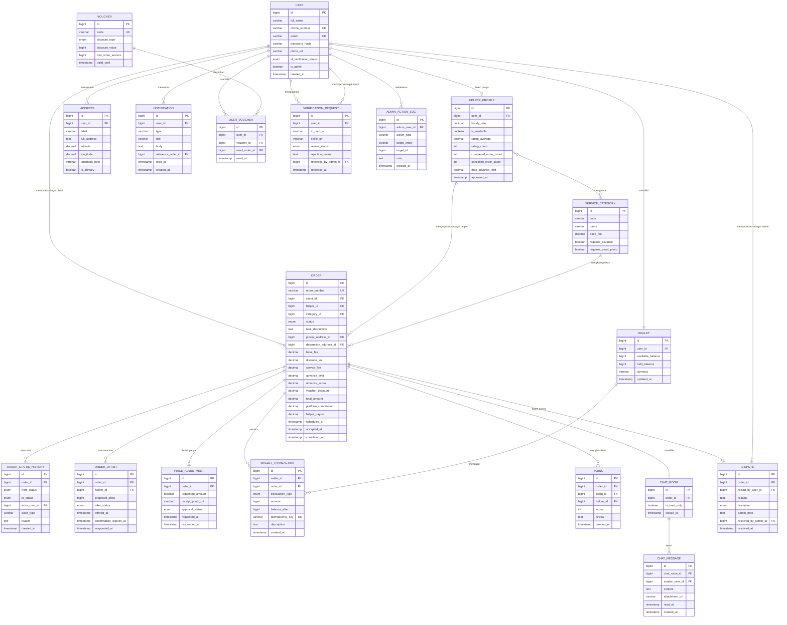

# ERD Draft dan Catatan Skema

Status dokumen: `REVIEW` v0.1. Perlu ditinjau Backend Developer sebelum dibekukan. Setelah dibekukan, perubahan lewat decision log.

## 1. Diagram

## 2. Keputusan skema yang perlu dipahami tim

Nominal uang disimpan sebagai bilangan bulat dalam satuan rupiah, bukan bilangan pecahan. Tipe `float` atau `double` untuk uang selalu berujung pada selisih pembulatan yang tidak bisa dijelaskan saat rekonsiliasi. Kalau BE lebih nyaman memakai `decimal`, tetapkan presisi 15 dengan skala 2 dan konsisten di seluruh kolom.

Dompet dipecah menjadi dua kolom saldo. `available_balance` adalah uang yang bisa dipakai, `held_balance` adalah uang yang sedang tertahan untuk pesanan berjalan. Pemisahan ini yang membuat penahanan dana bisa diaudit dan membuat invarian `INV-02` bisa diperiksa otomatis.

Tabel `wallet_transaction` bersifat tambah saja. Tidak ada operasi ubah atau hapus pada tabel ini. Koreksi dilakukan dengan menambah baris lawan, bukan mengubah baris lama. Kolom `balance_after` disimpan supaya riwayat mutasi bisa ditampilkan tanpa menghitung ulang seluruh baris.

Kolom `idempotency_key` bersifat unik dan menjadi pertahanan utama terhadap transaksi ganda. Setiap permintaan dari aplikasi yang menyentuh uang wajib membawa kunci ini.

Relasi `ORDER` ke `USER` terjadi dua kali, sebagai `client_id` dan sebagai `helper_id`. Perhatikan bahwa `helper_id` di sini menunjuk ke `helper_profile`, bukan langsung ke `user`, supaya tarif dan status ketersediaan pada saat pesanan dibuat bisa ditelusuri. BE perlu memutuskan apakah menyimpan salinan tarif pada baris pesanan, dan saya sarankan menyimpannya karena tarif helper bisa berubah setelah pesanan lama selesai.

Tabel `order_offer` diperbarui 19 Agustus 2026 mengikuti `DEC-05`, model tawar harga dua arah. Kolom `proposed_price` menyimpan nominal yang diajukan tiap helper, karena setiap helper boleh mengajukan angka berbeda dari harga estimasi client di kolom `order.base_fee`. Nilai `offer_status` yang berlaku sekarang adalah `submitted` saat helper baru mengajukan, `selected` saat client memilihnya dan menunggu konfirmasi, `confirmed` saat helper terpilih sudah mengonfirmasi dan dana ditahan, `not_selected` untuk tawaran lain yang otomatis tertutup, dan `withdrawn` kalau helper menarik tawarannya sendiri sebelum dipilih. Kolom `confirmation_expires_at` dipakai khusus pada status `selected`, menandai batas 60 detik sebelum client harus kembali memilih tawaran lain kalau helper tidak merespons.

Kolom `order.total_amount` yang tadinya dihitung dari `base_fee` ditambah komponen lain sekarang dihitung dari `proposed_price` milik tawaran yang berstatus `confirmed`, bukan dari `base_fee` client lagi. Kolom `base_fee` tetap disimpan sebagai harga estimasi awal untuk keperluan tampilan perbandingan, tapi tidak lagi jadi dasar penahanan dana.

Kolom `is_revealed` pada `rating` sudah dihapus 28 Agustus 2026 mengikuti `DEC-09`. Penilaian sekarang satu arah, hanya Client menilai Helper, jadi tabel `rating` disederhanakan jadi `client_id` dan `helper_id` langsung tanpa kolom `rater_role`, dan tidak butuh mekanisme tunda tampil karena tidak ada lagi pihak kedua yang ditunggu.

Modul admin, ditambahkan 28 Agustus 2026 mengikuti `DEC-07` yang sudah final. Kolom `is_admin` pada `user` menandai akun admin, dipakai untuk pengecekan otorisasi di setiap endpoint admin. BE perlu memastikan akun dengan `is_admin` bernilai benar tidak bisa dipakai mendaftar sebagai Client atau Helper lewat jalur normal, karena akun admin dibuat lewat proses terpisah, bukan lewat form registrasi publik.

Kolom `resolved_by_admin_id` pada `dispute` dan `reviewed_by_admin_id` pada `verification_request` mencatat admin mana yang mengambil keputusan, keduanya menunjuk ke `user.id` dengan syarat `is_admin` bernilai benar. Tabel `admin_action_log` ada supaya setiap tindakan admin (bukan cuma dua tabel itu) tercatat dalam satu tempat yang bisa diaudit, `target_entity` diisi nama tabel yang kena aksi seperti `verification_request` atau `dispute`, dan `target_id` diisi id barisnya.

## 3. Nilai enumerasi

| Kolom | Nilai yang diperbolehkan |
| --- | --- |
| `user.id_verification_status` | `unverified`, `pending`, `verified`, `rejected` |
| `order.status` | `draft`, `searching`, `accepted`, `on_the_way`, `arrived`, `in_progress`, `price_adjustment`, `awaiting_confirmation`, `completed`, `cancelled_by_client`, `cancelled_by_helper`, `expired`, `disputed`, `refunded` |
| `order_offer.offer_status` | `submitted`, `selected`, `confirmed`, `not_selected`, `withdrawn` (diperbaiki 28 Agu 2026, sebelumnya salah ketik menyisakan nilai lama yang sudah tidak berlaku sejak DEC-05) |
| `wallet_transaction.transaction_type` | `topup`, `hold`, `release`, `refund`, `payout`, `commission`, `adjustment`, `cancellation_fee` |
| `price_adjustment.approval_status` | `pending`, `approved`, `rejected` |
| `dispute.resolution` | `pending`, `favor_client`, `favor_helper`, `split`. Hanya berlaku untuk pesanan kategori Delivery sejak `DEC-10`, lihat pertanyaan terbuka soal Food run di `04_dual-role-transaction-analysis.md` |
| `admin_action_log.action_type` | `approve_verification`, `reject_verification`, `resolve_dispute` |

## 4. Indeks yang disarankan

BE perlu menambahkan indeks pada `order(client_id, status)` dan `order(helper_id, status)` karena dua kueri paling sering adalah daftar pesanan saya sebagai client dan pesanan aktif saya sebagai helper. Tambahkan juga indeks pada `order_offer(helper_id, offer_status)` untuk pencarian tawaran yang belum direspons, dan indeks unik pada `rating(order_id)` untuk menegakkan invarian `INV-08` di tingkat basis data, satu pesanan hanya boleh punya satu baris penilaian sejak rating jadi satu arah.
