# ERD Draft dan Catatan Skema

Status dokumen: `REVIEW` v0.2. Ditinjau Kai (Backend), hasil review di `tolongindong-erd-review.md`. **Penting**: review itu dilakukan atas versi sebelum modul ADM dan sebelum DEC-09 (rating jadi satu arah), jadi beberapa poin di review lama sudah tidak berlaku, ditandai eksplisit di catatan bawah. Seluruh perbaikan mekanis dari review sudah diterapkan ke diagram di bawah per 6 September 2026. Poin yang masih butuh keputusan tim tercantum di bagian 5.

## 1. Diagram

```mermaid
erDiagram
    USER ||--o| HELPER_PROFILE : "boleh punya"
    USER ||--|| WALLET : memiliki
    USER ||--o{ ADDRESS : menyimpan
    USER ||--o{ ORDER : "membuat sebagai client"
    HELPER_PROFILE ||--o{ ORDER : "mengerjakan sebagai helper"
    HELPER_PROFILE }o--o{ SERVICE_CATEGORY : menguasai
    SERVICE_CATEGORY ||--o{ ORDER : mengkategorikan
    ORDER ||--o{ ORDER_STATUS_HISTORY : mencatat
    ORDER ||--o{ ORDER_OFFER : menawarkan
    ORDER ||--o{ PRICE_ADJUSTMENT : "boleh punya lebih dari satu"
    ORDER ||--o{ WALLET_TRANSACTION : memicu
    ORDER ||--o{ RATING : menghasilkan
    ORDER ||--|| CHAT_ROOM : memiliki
    ORDER ||--o| DISPUTE : "boleh punya"
    WALLET ||--o{ WALLET_TRANSACTION : mencatat
    CHAT_ROOM ||--o{ CHAT_MESSAGE : berisi
    USER ||--o{ NOTIFICATION : menerima
    USER ||--o{ USER_VOUCHER : memiliki
    VOUCHER ||--o{ USER_VOUCHER : diterbitkan
    SERVICE_CATEGORY ||--o{ VOUCHER : "boleh membatasi"
    USER ||--o{ VERIFICATION_REQUEST : mengajukan
    USER ||--o{ VERIFICATION_REQUEST : "meninjau sebagai admin"
    USER ||--o{ DISPUTE : "memutuskan sebagai admin"
    USER ||--o{ ADMIN_ACTION_LOG : melakukan

    USER {
        bigint id PK
        varchar full_name
        varchar phone_number UK
        varchar email UK
        varchar password
        varchar photo_url
        enum verification_status
        boolean is_admin
        boolean is_suspended "baru 6 Sep 2026, FR-ADM-009"
        text suspended_reason "nullable, wajib diisi saat is_suspended benar"
        timestamp created_at
        timestamp updated_at
    }

    HELPER_PROFILE {
        bigint id PK
        bigint user_id FK
        bigint hourly_rate
        enum is_available
        decimal rating_average
        int rating_count
        int completed_order_count
        int cancelled_order_count
        bigint max_advance_limit
        timestamp approved_at
        timestamp updated_at
    }

    SERVICE_CATEGORY {
        bigint id PK
        varchar code
        varchar name
        bigint base_fee
        boolean requires_advance
        boolean requires_proof_photo
        boolean requires_pickup_address
        boolean requires_destination_address
        timestamp updated_at
    }

    ADDRESS {
        bigint id PK
        bigint user_id FK
        varchar label
        text full_address
        decimal latitude
        decimal longitude
        varchar landmark_note
        boolean is_primary
        timestamp created_at
        timestamp updated_at
    }

    ORDER {
        bigint id PK
        varchar order_number UK
        bigint client_id FK
        bigint helper_id FK
        bigint category_id FK
        enum status
        text task_description
        bigint pickup_address_id FK "nullable, tidak semua kategori butuh titik jemput"
        bigint destination_address_id FK "nullable, tidak semua kategori butuh titik tujuan"
        bigint base_fee
        bigint distance_fee
        bigint service_fee
        bigint advance_limit
        bigint advance_actual
        bigint voucher_discount
        bigint total_amount
        bigint platform_commission
        bigint helper_payout
        timestamp scheduled_at
        timestamp accepted_at
        timestamp completed_at
        timestamp updated_at
    }

    ORDER_OFFER {
        bigint id PK
        bigint order_id FK
        bigint helper_id FK
        bigint proposed_price
        enum offer_status
        timestamp offered_at
        timestamp confirmation_expires_at
        timestamp responded_at
        timestamp updated_at
    }

    ORDER_STATUS_HISTORY {
        bigint id PK
        bigint order_id FK
        enum from_status
        enum to_status
        bigint actor_user_id FK
        varchar actor_type
        text reason
        timestamp created_at
    }

    PRICE_ADJUSTMENT {
        bigint id PK
        bigint order_id FK
        bigint requested_amount
        varchar receipt_photo_url
        enum approval_status
        timestamp requested_at
        timestamp responded_at
        timestamp updated_at
    }

    WALLET {
        bigint id PK
        bigint user_id FK
        bigint available_balance
        bigint held_balance
        varchar currency
        timestamp updated_at
    }

    WALLET_TRANSACTION {
        bigint id PK
        bigint wallet_id FK
        bigint order_id FK
        enum transaction_type
        bigint amount
        bigint balance_after
        varchar idempotency_key UK
        text description
        timestamp created_at
    }

    RATING {
        bigint id PK
        bigint order_id FK
        bigint client_id FK
        bigint helper_id FK
        int score
        text review
        timestamp created_at
    }

    CHAT_ROOM {
        bigint id PK
        bigint order_id FK
        boolean is_read_only
        timestamp closed_at
        timestamp updated_at
    }

    CHAT_MESSAGE {
        bigint id PK
        bigint chat_room_id FK
        bigint sender_user_id FK
        text content
        varchar attachment_url
        timestamp read_at
        timestamp created_at
    }

    DISPUTE {
        bigint id PK
        bigint order_id FK
        bigint raised_by_user_id FK
        text reason
        enum resolution
        text admin_note
        bigint resolved_by_admin_id FK
        timestamp resolved_at
        timestamp updated_at
    }

    VERIFICATION_REQUEST {
        bigint id PK
        bigint user_id FK
        varchar id_card_url
        varchar selfie_url
        enum review_status
        text rejection_reason
        bigint reviewed_by_admin_id FK
        timestamp reviewed_at
        timestamp next_resubmission_allowed_at "batas cooldown, isi kalau ditolak"
        timestamp updated_at
    }

    ADMIN_ACTION_LOG {
        bigint id PK
        bigint admin_user_id FK
        varchar action_type
        varchar target_entity
        bigint target_id
        text note
        timestamp created_at
    }

    VOUCHER {
        bigint id PK
        varchar code UK
        enum discount_type
        bigint discount_value
        bigint max_discount_amount "nullable, cap untuk tipe persenan"
        bigint min_order_amount
        bigint usage_limit "nullable, batas total klaim"
        bigint category_id FK "nullable, null berarti berlaku semua kategori"
        timestamp valid_from
        timestamp valid_until
        timestamp created_at
    }

    USER_VOUCHER {
        bigint id PK
        bigint user_id FK
        bigint voucher_id FK
        bigint used_order_id FK "nullable, boleh lebih dari satu baris menunjuk order yang sama sejak voucher boleh ditumpuk"
        bigint discount_applied "nominal diskon sungguhan saat dipakai, dicatat terpisah dari VOUCHER.discount_value supaya riwayat tetap benar walau syarat voucher berubah belakangan"
        timestamp used_at
    }

    NOTIFICATION {
        bigint id PK
        bigint user_id FK
        enum type
        varchar title
        text body
        bigint reference_order_id FK
        timestamp read_at
        timestamp created_at
    }
```

## 2. Keputusan skema yang perlu dipahami tim

Nominal uang disimpan sebagai bilangan bulat dalam satuan rupiah, bukan bilangan pecahan. Tipe `float` atau `double` untuk uang selalu berujung pada selisih pembulatan yang tidak bisa dijelaskan saat rekonsiliasi. Sempat ada opsi memakai `decimal` presisi 15 skala 2, tapi Kai sudah menetapkan `bigint` secara konsisten di seluruh kolom nominal (6 September 2026), jadi pertanyaan ini sudah tertutup.

Dompet dipecah menjadi dua kolom saldo. `available_balance` adalah uang yang bisa dipakai, `held_balance` adalah uang yang sedang tertahan untuk pesanan berjalan. Pemisahan ini yang membuat penahanan dana bisa diaudit dan membuat invarian `INV-02` bisa diperiksa otomatis.

Tabel `wallet_transaction` bersifat tambah saja. Tidak ada operasi ubah atau hapus pada tabel ini. Koreksi dilakukan dengan menambah baris lawan, bukan mengubah baris lama. Kolom `balance_after` disimpan supaya riwayat mutasi bisa ditampilkan tanpa menghitung ulang seluruh baris.

Kolom `idempotency_key` bersifat unik dan menjadi pertahanan utama terhadap transaksi ganda. Setiap permintaan dari aplikasi yang menyentuh uang wajib membawa kunci ini.

Relasi `ORDER` ke `USER` terjadi dua kali, sebagai `client_id` dan sebagai `helper_id`. Perhatikan bahwa `helper_id` di sini menunjuk ke `helper_profile`, bukan langsung ke `user`, supaya tarif dan status ketersediaan pada saat pesanan dibuat bisa ditelusuri. BE perlu memutuskan apakah menyimpan salinan tarif pada baris pesanan, dan saya sarankan menyimpannya karena tarif helper bisa berubah setelah pesanan lama selesai.

Tabel `order_offer` diperbarui 19 Agustus 2026 mengikuti `DEC-05`, model tawar harga dua arah. Kolom `proposed_price` menyimpan nominal yang diajukan tiap helper, karena setiap helper boleh mengajukan angka berbeda dari harga estimasi client di kolom `order.base_fee`. Nilai `offer_status` yang berlaku sekarang adalah `submitted` saat helper baru mengajukan, `selected` saat client memilihnya dan menunggu konfirmasi, `confirmed` saat helper terpilih sudah mengonfirmasi dan dana ditahan, `not_selected` untuk tawaran lain yang otomatis tertutup, dan `withdrawn` kalau helper menarik tawarannya sendiri sebelum dipilih. Kolom `confirmation_expires_at` dipakai khusus pada status `selected`, menandai batas 60 detik sebelum client harus kembali memilih tawaran lain kalau helper tidak merespons.

Kolom `order.total_amount` yang tadinya dihitung dari `base_fee` ditambah komponen lain sekarang dihitung dari `proposed_price` milik tawaran yang berstatus `confirmed`, bukan dari `base_fee` client lagi. Kolom `base_fee` tetap disimpan sebagai harga estimasi awal untuk keperluan tampilan perbandingan, tapi tidak lagi jadi dasar penahanan dana.

Kolom `is_revealed` pada `rating` sudah dihapus 28 Agustus 2026 mengikuti `DEC-09`. Penilaian sekarang satu arah, hanya Client menilai Helper, jadi tabel `rating` disederhanakan jadi `client_id` dan `helper_id` langsung tanpa kolom `rater_role`, dan tidak butuh mekanisme tunda tampil karena tidak ada lagi pihak kedua yang ditunggu.

Modul admin, ditambahkan 28 Agustus 2026 mengikuti `DEC-07` yang sudah final. Kolom `is_admin` pada `user` menandai akun admin, dipakai untuk pengecekan otorisasi di setiap endpoint admin. BE perlu memastikan akun dengan `is_admin` bernilai benar tidak bisa dipakai mendaftar sebagai Client atau Helper lewat jalur normal, karena akun admin dibuat lewat proses terpisah, bukan lewat form registrasi publik.

Kolom `resolved_by_admin_id` pada `dispute` dan `reviewed_by_admin_id` pada `verification_request` mencatat admin mana yang mengambil keputusan, keduanya menunjuk ke `user.id` dengan syarat `is_admin` bernilai benar. Tabel `admin_action_log` ada supaya setiap tindakan admin (bukan cuma dua tabel itu) tercatat dalam satu tempat yang bisa diaudit, `target_entity` diisi nama tabel yang kena aksi seperti `verification_request` atau `dispute`, dan `target_id` diisi id barisnya.

Perhitungan `platform_commission`, dikonfirmasi 6 September 2026 lewat sesi BE. Voucher dipotong dari komisi platform, bukan mengurangi bagian yang diterima Helper. Urutannya: `platform_commission = (total_amount x 10 persen) - voucher_discount`, dengan batas bawah nol supaya komisi tidak pernah negatif kalau diskon voucher lebih besar dari komisi normal. `helper_payout` tetap dihitung dari `total_amount - platform_commission`, tidak pernah dipotong voucher secara langsung.

## 2B. Hasil review Kai (Backend), diterapkan 6 September 2026

Review lengkap ada di `tolongindong-erd-review.md`. Bagian ini merangkum apa yang sudah diterapkan langsung ke diagram di atas, dan mana yang ternyata sudah tidak relevan karena Kai mereview versi lama.

**Sudah diterapkan langsung, tidak perlu didiskusikan lagi.** Kolom `password_hash` di `user` diganti jadi `password` mengikuti konvensi `Authenticatable` Laravel. Kolom `id_verification_status` diganti `verification_status`, prefix `id_` dihapus karena redundan sudah jelas dari konteks tabel. Seluruh kolom nominal uang yang sebelumnya `decimal` (di `helper_profile`, `service_category`, `order`, `price_adjustment`) diseragamkan jadi `bigint`, memperbaiki inkonsistensi karena catatan skema di bagian dua sudah lama bilang bigint tapi diagramnya masih decimal. Kolom `updated_at` ditambahkan ke seluruh tabel yang sifatnya bisa diubah (`user`, `helper_profile`, `service_category`, `address`, `order`, `order_offer`, `price_adjustment`, `dispute`, `verification_request`, `voucher`, `chat_room`), dikecualikan `wallet_transaction` dan `order_status_history` yang append-only. Kolom `is_available` di `helper_profile` diganti dari boolean jadi enum tiga nilai, supaya bisa bedakan helper yang sedang libur sendiri dengan helper yang di-suspend admin. Kolom `pickup_address_id` dan `destination_address_id` di `order` ditandai nullable karena tidak semua kategori butuh dua titik lokasi, dan dua kolom baru `requires_pickup_address` serta `requires_destination_address` ditambahkan ke `service_category` supaya aturan itu datanya terpusat, bukan hardcode per kategori di kode. Tabel `voucher` mendapat empat kolom baru, `max_discount_amount`, `valid_from`, `created_at`, `usage_limit`, dan relasi baru `category_id` ke `service_category`. Kolom `notification.type` diganti dari varchar bebas jadi enum. Terakhir, `verification_request` mendapat kolom baru `next_resubmission_allowed_at` untuk menjawab celah cooldown pengajuan ulang yang Kai temukan, belum ada requirement yang menetapkan durasinya, itu masuk daftar keputusan di bagian lima.

**Sudah tidak relevan, ditulis Kai atas versi lama.** Kai mempertahankan kolom `is_revealed` pada `rating` dengan alasan mencegah rating balas dendam, itu benar untuk desain lama, tapi kolom itu sudah dihapus 28 Agustus mengikuti `DEC-09` karena rating sekarang satu arah saja. Review Kai juga sama sekali tidak menyinggung modul admin (`is_admin`, `admin_action_log`, `resolved_by_admin_id`, `reviewed_by_admin_id`), karena modul itu ditambahkan di hari yang sama dengan DEC-09, setelah salinan yang dia terima. Ini yang paling penting disampaikan di awal sesi supaya tidak ada bagian diskusi yang berputar di keputusan yang sebenarnya sudah diambil.

**Sudah terjawab lewat decision log, tapi disebut Kai sebagai masih terbuka.** Soal siapa menanggung `platform_commission`, itu sudah terjawab oleh `DEC-08`, ditanggung Helper, dipotong dari nominal yang dia terima. Kemungkinan salinan yang Kai baca juga lebih lama dari tanggal keputusan itu.

## 3. Nilai enumerasi

| Kolom | Nilai yang diperbolehkan |
| --- | --- |
| `user.verification_status` | `unverified`, `pending`, `verified`, `rejected` |
| `helper_profile.is_available` | `available`, `unavailable`, `suspended` (diganti dari boolean 6 Sep 2026, usulan Kai) |
| `order.status` | `draft`, `searching`, `accepted`, `on_the_way`, `arrived`, `in_progress`, `price_adjustment`, `awaiting_confirmation`, `completed`, `cancelled_by_client`, `cancelled_by_helper`, `expired`, `disputed`, `refunded` |
| `order_offer.offer_status` | `submitted`, `selected`, `confirmed`, `not_selected`, `withdrawn` (diperbaiki 6 Sep 2026, sebelumnya salah ketik menyisakan nilai lama yang sudah tidak berlaku sejak DEC-05) |
| `wallet_transaction.transaction_type` | `topup`, `hold`, `release`, `refund`, `payout`, `commission`, `adjustment`, `cancellation_fee` |
| `price_adjustment.approval_status` | `pending`, `approved`, `rejected` |
| `dispute.resolution` | `pending`, `favor_client`, `favor_helper`, `split`. Hanya berlaku untuk pesanan kategori Delivery sejak `DEC-10`, lihat pertanyaan terbuka soal Food run di `04_dual-role-transaction-analysis.md` |
| `admin_action_log.action_type` | `approve_verification`, `reject_verification`, `resolve_dispute`, `suspend_account`, `reactivate_account` |
| `notification.type` | `order_offer`, `order_status_change`, `chat_message`, `dispute_update`, `wallet_topup`, `promo` (diganti dari varchar bebas 6 Sep 2026, usulan Kai) |

## 3B. Keputusan dari sesi BE, 6 September 2026

Enam dari dua belas pertanyaan sudah terjawab langsung di sesi dengan Kai. Enam sisanya belum dibahas, saya kasih rekomendasi di bawah supaya kamu punya draf jawaban buat dibawa ke tim, bukan keputusan final.

### Sudah terjawab

| No | Pertanyaan | Jawaban | Catatan |
| --- | --- | --- | --- |
| 5 | Siapa menanggung `voucher_discount` | Dipotong dari `platform_commission`, bukan beban terpisah | Komisi bersih yang diterima platform jadi lebih kecil saat voucher dipakai, bukan mengurangi bagian Helper. Perlu masuk rumus `order.total_amount` |
| 6 | Voucher boleh ditumpuk | Boleh | Ternyata tidak butuh tabel baru. `USER_VOUCHER.used_order_id` dari dulu sudah bisa menunjuk banyak baris ke pesanan yang sama, jadi struktur lama sudah mendukung ini. Saya tambahkan kolom `discount_applied` di `USER_VOUCHER` supaya nominal diskon sungguhan tercatat per klaim, bukan dihitung ulang dari `VOUCHER.discount_value` yang bisa berubah belakangan |
| 7 | Cooldown verifikasi setelah ditolak | 2 menit | **Catatan SA**: ini terasa sangat pendek dibanding praktik umum (biasanya dihitung jam atau hari, saya sendiri mengusulkan 24 sampai 72 jam). Dengan cooldown sependek ini, kolom `next_resubmission_allowed_at` nyaris tidak berfungsi sebagai penahan, karena peninjauan admin manual pasti lebih lama dari 2 menit. Tolong dikonfirmasi ulang ke Kai, apakah maksudnya memang 2 menit atau ada salah dengar dengan satuan lain seperti 2 jam atau 2 hari. Saya terapkan sebagai 2 menit di bawah sesuai yang kamu laporkan, tapi ini yang paling perlu dicek ulang dari seluruh hasil sesi ini |
| 8 | Enkripsi foto KTP/swafoto | Private bucket plus signed URL sudah cukup, tidak perlu enkripsi at-rest tambahan | Tidak ada perubahan skema, `NFR-SEC-03` sudah sesuai |
| 11 | Enkripsi `phone_number` | Tidak usah | Sesuai rekomendasi awal Kai sendiri, tinggal dicatat sebagai final |
| 12 | Admin butuh suspend akun secara umum | Butuh | Modul ADM perlu FR baru dan endpoint baru, lihat perubahan di bawah |

### Rekomendasi SA untuk enam yang belum dibahas

Ini draf saya, bukan keputusan. Empat di antaranya (1, 3, 9, 10) sebaiknya tetap dikonfirmasi ke tim yang lebih luas sebelum final, karena sifatnya perluasan lingkup produk, bukan detail teknis murni.

**Soal 1, itemisasi order.** Rekomendasi saya, **tidak usah**, untuk lingkup lab. Alasannya, desain sekarang (deskripsi teks bebas plus nominal lumpsum) sudah menampung kasus "belanja beberapa barang dari satu toko", dan kasus yang benar benar butuh itemisasi, yaitu belanja dari beberapa toko berbeda dalam satu pesanan, cukup jarang dan bisa diakali client dengan membuat pesanan terpisah per toko kalau memang perlu. Membangun `ORDER_ITEM` menyentuh alur pembuatan pesanan di UI/UX, skema di BE, dan tidak ada di linimasa manapun sekarang. Catat sebagai keterbatasan yang diketahui, bukan dikerjakan.

**Soal 2, kardinalitas `PRICE_ADJUSTMENT`.** Terlepas dari jawaban soal 1, saya tetap rekomendasikan **naikkan dari 0/1 jadi 0/banyak**. Ini perbaikan murah, cuma mengubah batas relasi bukan menambah tabel baru, tapi menutup celah nyata, helper bisa saja perlu mengajukan penyesuaian lebih dari sekali dalam satu pesanan Food run kalau estimasi pertama meleset lagi setelah disetujui. Ini soal teknis, boleh langsung dikonfirmasi ke Kai tanpa perlu naik ke tim luas.

**Soal 3, definisi kategori selain Food run.** Ini soal produk, bukan cuma teknis, sebaiknya kamu bawa ke tim, tapi saya siapkan draf tebakan awal supaya diskusinya tidak mulai dari kertas kosong.

| Kategori | Draf cakupan tugas |
| --- | --- |
| Delivery | Helper mengantar barang yang sudah dimiliki atau disiapkan client dari satu titik ke titik lain. Beda dari Food run, helper tidak membeli apa pun, jadi tidak butuh talangan |
| Moving | Bantu pindahan barang pribadi dalam jumlah kecil (beberapa kardus atau perabot kecil), bukan pindahan rumah penuh dengan truk, cocok untuk helper bermotor |
| Personal | Kategori serba guna untuk tugas pribadi yang tidak masuk kategori lain, seperti antre, ambil dokumen, atau errand sederhana |
| Household | Tugas di lokasi rumah client, seperti bersih bersih, perbaikan kecil, atau rakit barang. Beda dari kategori lain, kemungkinan cuma butuh satu alamat, tidak butuh alamat tujuan |
| Laundry | Helper jemput cucian kotor, antar ke tempat cuci atau cuci sendiri, lalu antar balik. Bisa juga butuh talangan kalau helper membayar jasa laundry di muka |

**Soal 4, rumus `service_fee`.** Rekomendasi saya, buat sesederhana mungkin, **`service_fee` sama dengan `SERVICE_CATEGORY.base_fee`**, angka flat per kategori, tidak dikalikan durasi sama sekali. Alasannya, angka ini cuma jadi rentang estimasi awal yang ditampilkan sebelum tawar harga dimulai, bukan harga mengikat, karena harga final tetap datang dari tawaran bebas Helper (`DEC-05`). Menghitung durasi estimasi per kategori butuh data yang belum kita punya dan tidak akan mengubah harga akhir, jadi tidak sepadan effort-nya untuk lingkup lab.

**Soal 9, batas 10 alamat.** Rekomendasi saya, **pertahankan angka 10, cukup nyatakan sebagai keputusan UX yang disengaja**, bukan kebetulan ikut prototipe. Sepuluh alamat itu jumlah yang wajar untuk kebanyakan pengguna (rumah, kantor, beberapa tempat favorit), tidak ada urgensi mengubah jadi bisa diatur admin atau ditambah. Cukup ubah kolom `Sumber` di `FR-PRF-002` dari `PROTO` jadi `TURUNAN` kalau tim setuju alasan ini.

**Soal 10, chat sebelum pesanan dibuat.** Rekomendasi saya, **tidak usah**, untuk lingkup lab, alasannya sama seperti soal 1, ini perluasan lingkup yang menyentuh banyak bagian (skema `CHAT_ROOM` harus berubah struktural, perlu mekanisme pairing baru tanpa pesanan, ada risiko penyalahgunaan seperti spam pesan yang belum ada pagarnya). Profil helper yang sudah menampilkan rating dan ulasan harusnya cukup untuk client memutuskan tanpa perlu chat dulu. Catat sebagai ide backlog, bukan dikerjakan sekarang.

Yang tidak perlu dibahas lagi karena sudah punya jawaban, cukup dikonfirmasi ke Kai supaya salinannya sinkron: dompet simulasi (`DEC-04`), komisi 10 persen ditanggung Helper (`DEC-08`), mekanisme akses admin lewat panel sungguhan (`DEC-07`).

## 4. Indeks yang disarankan

BE perlu menambahkan indeks pada `order(client_id, status)` dan `order(helper_id, status)` karena dua kueri paling sering adalah daftar pesanan saya sebagai client dan pesanan aktif saya sebagai helper. Tambahkan juga indeks pada `order_offer(helper_id, offer_status)` untuk pencarian tawaran yang belum direspons, dan indeks unik pada `rating(order_id)` untuk menegakkan invarian `INV-08` di tingkat basis data, satu pesanan hanya boleh punya satu baris penilaian sejak rating jadi satu arah.
