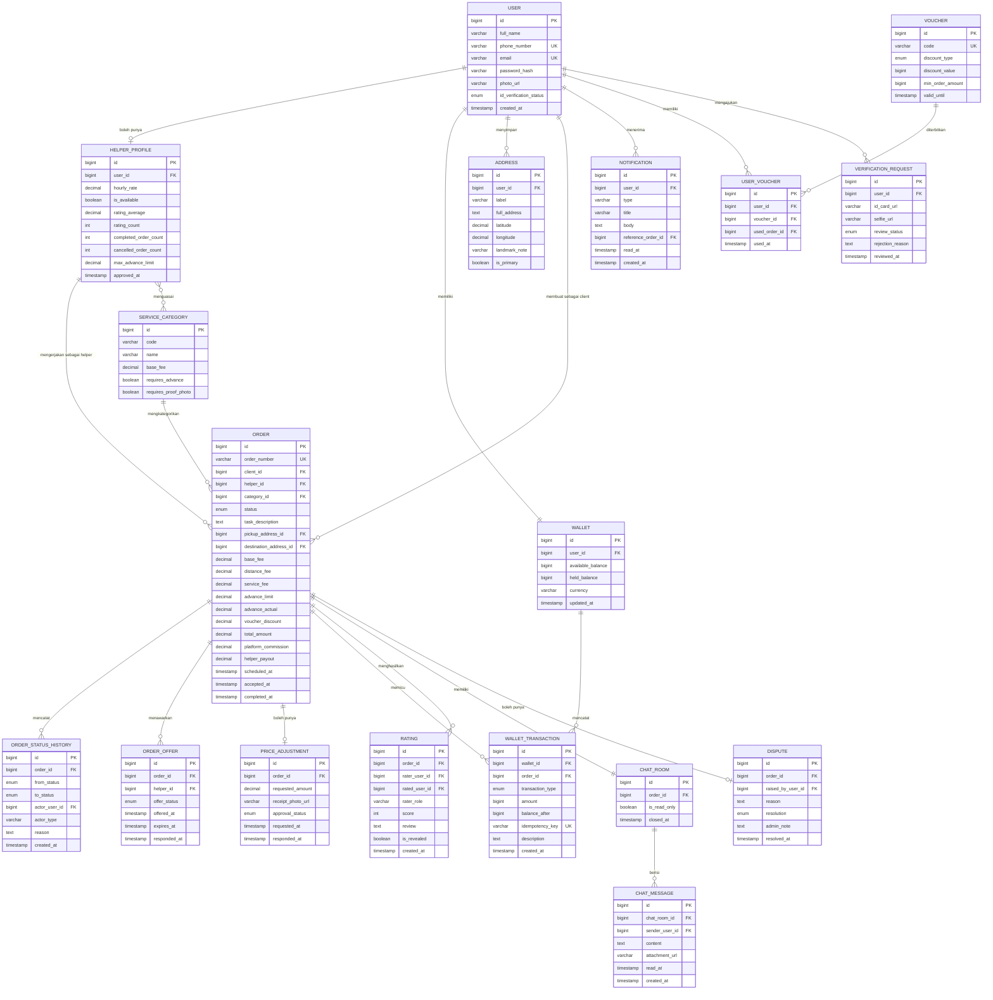

# ERD Draft dan Catatan Skema

Status dokumen: `REVIEW` v0.1. Perlu ditinjau Backend Developer sebelum dibekukan. Setelah dibekukan, perubahan lewat decision log.

## 1. Diagram

## 2. Keputusan skema yang perlu dipahami tim

Nominal uang disimpan sebagai bilangan bulat dalam satuan rupiah, bukan bilangan pecahan. Tipe `float` atau `double` untuk uang selalu berujung pada selisih pembulatan yang tidak bisa dijelaskan saat rekonsiliasi. Kalau BE lebih nyaman memakai `decimal`, tetapkan presisi 15 dengan skala 2 dan konsisten di seluruh kolom.

Dompet dipecah menjadi dua kolom saldo. `available_balance` adalah uang yang bisa dipakai, `held_balance` adalah uang yang sedang tertahan untuk pesanan berjalan. Pemisahan ini yang membuat penahanan dana bisa diaudit dan membuat invarian `INV-02` bisa diperiksa otomatis.

Tabel `wallet_transaction` bersifat tambah saja. Tidak ada operasi ubah atau hapus pada tabel ini. Koreksi dilakukan dengan menambah baris lawan, bukan mengubah baris lama. Kolom `balance_after` disimpan supaya riwayat mutasi bisa ditampilkan tanpa menghitung ulang seluruh baris.

Kolom `idempotency_key` bersifat unik dan menjadi pertahanan utama terhadap transaksi ganda. Setiap permintaan dari aplikasi yang menyentuh uang wajib membawa kunci ini.

Relasi `ORDER` ke `USER` terjadi dua kali, sebagai `client_id` dan sebagai `helper_id`. Perhatikan bahwa `helper_id` di sini menunjuk ke `helper_profile`, bukan langsung ke `user`, supaya tarif dan status ketersediaan pada saat pesanan dibuat bisa ditelusuri. BE perlu memutuskan apakah menyimpan salinan tarif pada baris pesanan, dan saya sarankan menyimpannya karena tarif helper bisa berubah setelah pesanan lama selesai.

Tabel `order_offer` ada supaya penawaran serentak bisa dilacak. Tanpa tabel ini, kita tidak bisa menjawab pertanyaan siapa saja yang ditawari dan siapa yang melewatkan, padahal itu data penting untuk memperbaiki algoritma pencocokan.

Kolom `is_revealed` pada `rating` melaksanakan aturan penilaian tertutup. Penilaian dibuat lebih dulu tetapi baru terlihat setelah kedua pihak mengisi atau tenggat lewat.

## 3. Nilai enumerasi

| Kolom | Nilai yang diperbolehkan |
| --- | --- |
| `user.id_verification_status` | `unverified`, `pending`, `verified`, `rejected` |
| `order.status` | `draft`, `searching`, `accepted`, `on_the_way`, `arrived`, `in_progress`, `price_adjustment`, `awaiting_confirmation`, `completed`, `cancelled_by_client`, `cancelled_by_helper`, `expired`, `disputed`, `refunded` |
| `order_offer.offer_status` | `sent`, `accepted`, `skipped`, `expired` |
| `wallet_transaction.transaction_type` | `topup`, `hold`, `release`, `refund`, `payout`, `commission`, `adjustment`, `cancellation_fee` |
| `price_adjustment.approval_status` | `pending`, `approved`, `rejected` |
| `dispute.resolution` | `pending`, `favor_client`, `favor_helper`, `split` |
| `rating.rater_role` | `client`, `helper` |

## 4. Indeks yang disarankan

BE perlu menambahkan indeks pada `order(client_id, status)` dan `order(helper_id, status)` karena dua kueri paling sering adalah daftar pesanan saya sebagai client dan pesanan aktif saya sebagai helper. Tambahkan juga indeks pada `order_offer(helper_id, offer_status)` untuk pencarian tawaran yang belum direspons, dan indeks unik gabungan pada `rating(order_id, rater_role)` untuk menegakkan invarian `INV-08` di tingkat basis data, bukan hanya di kode.
