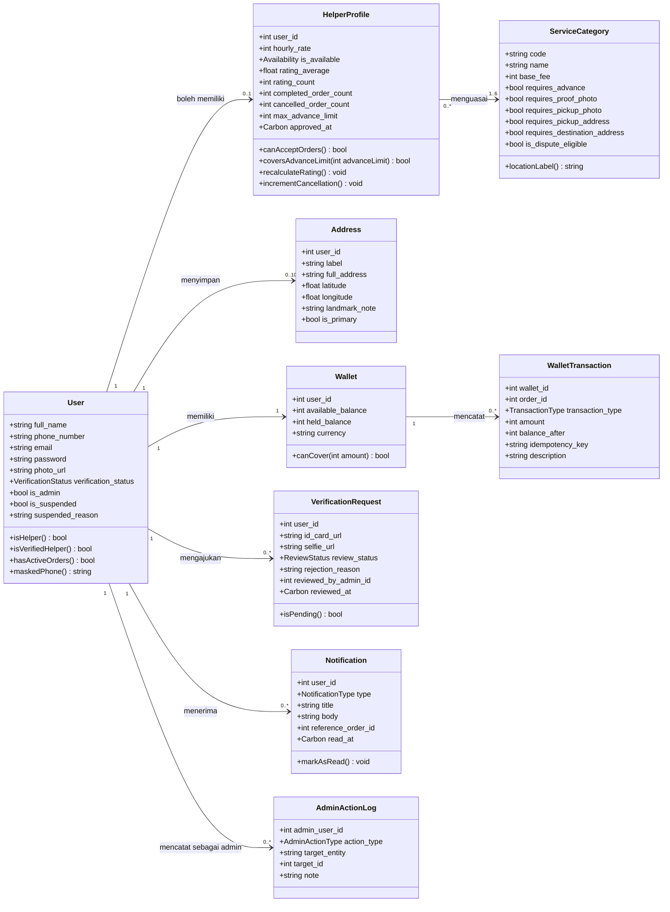
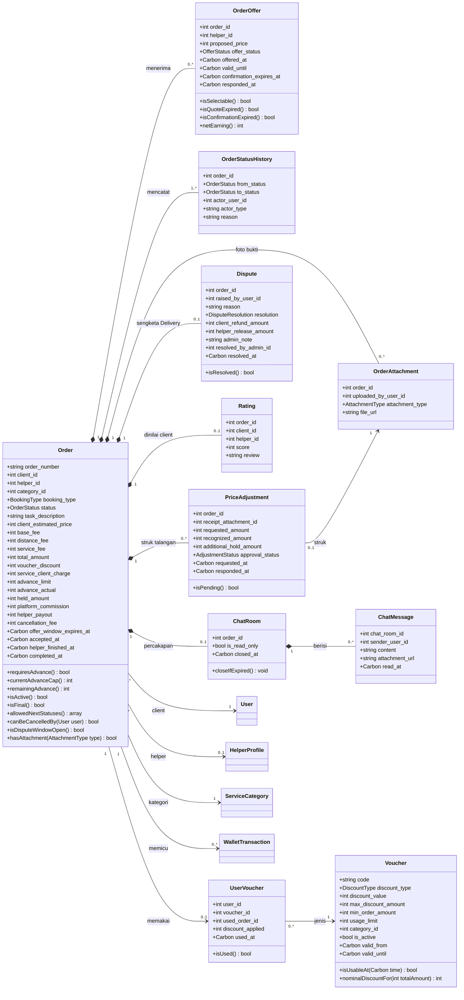

# Class Diagram

Status dokumen: `REVIEW` v0.1, 28 September 2026. Diagram ini menurunkan `05_erd-draft.md` v0.3 dan aturan di `04_dual-role-transaction-analysis.md` v0.2 menjadi rancangan kelas untuk backend Laravel. Seluruh keputusan DEC-14 sampai DEC-24 sudah tercermin.

## 1. Cara membaca dokumen ini

ERD menjawab bagaimana data disimpan. Class diagram menjawab objek apa yang ada dan perilaku apa yang dimiliki tiap objek. Karena itu diagram ini memuat method, sedangkan ERD tidak.

Rancangan mengikuti pola yang lazim di Laravel. Model Eloquent menyimpan data dan perilaku sederhana yang hanya menyentuh dirinya sendiri, misalnya `Order::canBeCancelledBy()`. Aturan yang menyentuh lebih dari satu model atau memindahkan uang ditempatkan di kelas service, misalnya `EscrowService::hold()` yang mengubah `Order`, `Wallet`, dan `WalletTransaction` dalam satu transaksi basis data. Dengan pembagian ini, seluruh invarian uang (INV-01 sampai INV-04, INV-09 sampai INV-12) punya satu tempat penegakan.

Diagram dipecah menjadi empat bagian supaya tetap terbaca:

1. Akun, helper, dan dompet.
2. Pesanan dan turunannya.
3. Enumerasi.
4. Service layer.

Konvensi penulisan:
- Atribut memakai `snake_case` sama dengan kolom basis data, karena Eloquent membaca atribut langsung dari kolom.
- Method memakai `camelCase` sesuai PSR-12.
- Tipe `int` untuk seluruh nominal uang (rupiah penuh, dari kolom `bigint`), `Carbon` untuk waktu.
- `+` publik, `-` privat. Atribut `id`, `created_at`, dan `updated_at` tidak ditulis ulang di setiap kelas.

Versi resmi untuk SRS dan SDD sebaiknya digambar ulang di draw.io atau StarUML dari diagram ini. Mermaid dipakai di repo karena bisa ditinjau langsung di GitHub dan dilacak perubahannya lewat git.

## 2. Akun, helper, dan dompet

Catatan bagian ini:

- `User` selalu punya kapabilitas client. `HelperProfile` bersifat opsional dan baru aktif setelah verifikasi (DEC-01). Karena itu `isHelper()` hanya memeriksa keberadaan profil, sedangkan `isVerifiedHelper()` juga memeriksa `verification_status`.
- `hasActiveOrders()` dipakai `AdminService` sebelum suspend. Method ini mencari pesanan berstatus `pending_confirmation` sampai `awaiting_confirmation` atau `disputed`, baik sebagai client maupun helper (DEC-22).
- `coversAdvanceLimit()` membandingkan `max_advance_limit` dengan batas talangan pesanan (DEC-17). `OfferService` dan `OrderService` sama-sama memakainya.
- `locationLabel()` mengembalikan "Lokasi pengerjaan" untuk Personal dan Household, dan "Alamat tujuan" untuk kategori lain (DEC-16).
- Multiplisitas `0..10` pada alamat berasal dari FR-PRF-002, dan `1..6` pada kategori dari FR-HLP-008. Relasi kategori helper disimpan di tabel pivot `helper_service_categories`.
- `Wallet` sengaja tidak punya method yang mengubah saldo. Saldo hanya boleh berubah lewat `EscrowService` atau `WalletService` di bagian 5, supaya setiap perubahan selalu disertai baris `WalletTransaction` dan kunci baris `SELECT ... FOR UPDATE`.

## 3. Pesanan dan turunannya

Catatan bagian ini:

- Komposisi (belah ketupat penuh) dipakai untuk objek yang tidak punya arti tanpa pesanannya: tawaran, riwayat status, lampiran, struk, sengketa, rating, dan ruang chat. Asosiasi biasa dipakai untuk objek yang hidup mandiri seperti `User`, `ServiceCategory`, dan `Voucher`.
- `Order` ke `HelperProfile` bermultiplisitas `0..1` karena helper baru terisi saat dana ditahan. Selama `searching` atau `awaiting_quote`, `helper_id` masih kosong.
- `Order` ke `ChatRoom` bermultiplisitas `0..1`. Ruang chat baru dibuat saat pesanan `accepted` (DEC-14 nomor 10), sehingga pesanan yang kedaluwarsa tidak pernah punya ruang chat. ERD v0.3 sudah memakai multiplisitas yang sama.
- `currentAdvanceCap()` menghitung batas talangan yang sedang berlaku sebagai `held_amount - service_client_charge`, karena batas awal bisa naik lewat penyesuaian yang disetujui. `remainingAdvance()` sama dengan batas berlaku dikurangi `advance_actual`.
- `allowedNextStatuses()` membaca tabel transisi `OrderStateMachine` di bagian 5, lalu memfilter berdasarkan kategori. Contohnya, `disputed` hanya muncul kalau kategori `is_dispute_eligible`. API-ORD-05 mengirim hasil method ini ke Mobile.
- `netEarning()` pada `OrderOffer` mengembalikan `proposed_price - floor(proposed_price x 10%)` untuk layar helper (FR-ORD-006). Angka ini tidak pernah dipengaruhi voucher (INV-12).
- `nominalDiscountFor()` pada `Voucher` menghitung diskon mentah dari jenis voucher. Pembatasan terhadap komisi dilakukan `SettlementCalculator`, bukan di sini, supaya aturan INV-11 hanya ada di satu tempat.

## 4. Enumerasi

```mermaid
classDiagram
    direction LR

    class OrderStatus {
        <<enumeration>>
        DRAFT
        SEARCHING
        AWAITING_QUOTE
        PENDING_CONFIRMATION
        ACCEPTED
        ON_THE_WAY
        ARRIVED
        IN_PROGRESS
        PRICE_ADJUSTMENT
        AWAITING_CONFIRMATION
        COMPLETED
        CANCELLED_BY_CLIENT
        CANCELLED_BY_HELPER
        CANCELLED_BY_ADMIN
        EXPIRED
        DISPUTED
        REFUNDED
        PARTIALLY_REFUNDED
    }

    class BookingType {
        <<enumeration>>
        BROADCAST
        DIRECT
    }

    class OfferStatus {
        <<enumeration>>
        SUBMITTED
        SELECTED
        CONFIRMED
        NOT_SELECTED
        WITHDRAWN
        EXPIRED
        DECLINED
    }

    class AdjustmentStatus {
        <<enumeration>>
        PENDING
        APPROVED
        REJECTED
        AUTO_APPROVED
    }

    class AttachmentType {
        <<enumeration>>
        PICKUP_PROOF
        COMPLETION_PROOF
        DISPUTE_EVIDENCE
        RECEIPT
    }

    class TransactionType {
        <<enumeration>>
        TOPUP
        HOLD
        RELEASE
        ADVANCE_REIMBURSEMENT
        REFUND
        PAYOUT
        CANCELLATION_FEE
    }

    class DisputeResolution {
        <<enumeration>>
        PENDING
        FAVOR_CLIENT
        FAVOR_HELPER
        SPLIT
    }

    class VerificationStatus {
        <<enumeration>>
        UNVERIFIED
        PENDING
        VERIFIED
        REJECTED
    }

    class ReviewStatus {
        <<enumeration>>
        PENDING
        VERIFIED
        REJECTED
    }

    class Availability {
        <<enumeration>>
        AVAILABLE
        UNAVAILABLE
    }

    class DiscountType {
        <<enumeration>>
        FIXED
        PERCENTAGE
    }

    class AdminActionType {
        <<enumeration>>
        APPROVE_VERIFICATION
        REJECT_VERIFICATION
        RESOLVE_DISPUTE
        SUSPEND_ACCOUNT
        REACTIVATE_ACCOUNT
        CANCEL_ORDER
        CREATE_VOUCHER
        UPDATE_VOUCHER
        DEACTIVATE_VOUCHER
    }

    class NotificationType {
        <<enumeration>>
        ORDER_OFFER
        ORDER_STATUS_CHANGE
        CHAT_MESSAGE
        DISPUTE_UPDATE
        WALLET_MUTATION
        PROMO
    }
```

Di Laravel, setiap enumerasi menjadi PHP backed enum (`enum OrderStatus: string`) dengan nilai huruf kecil sama persis dengan isi kolom basis data, misalnya `case PendingConfirmation = 'pending_confirmation'`. Huruf besar di diagram hanya konvensi UML.

`ReviewStatus` ditulis terpisah dari `VerificationStatus` karena `verification_request.review_status` tidak punya nilai `unverified`. Nilai `unverified` hanya berlaku pada ringkasan di `user.verification_status`.

## 5. Service layer

```mermaid
classDiagram
    direction TB

    class OrderStateMachine {
        -array transitions
        +canTransition(Order order, OrderStatus to) bool
        +transition(Order order, OrderStatus to, User actor, string reason) void
        -assertPhotoRequirements(Order order, OrderStatus to) void
        -recordHistory(Order order, OrderStatus from, OrderStatus to, User actor) void
    }

    class OrderService {
        +estimate(EstimateRequest data) ReferencePricing
        +create(User client, CreateOrderRequest data) Order
        +rebroadcast(Order expiredDirectOrder) Order
        +expireOfferWindow(Order order) void
        +autoConfirm(Order order) void
    }

    class OfferService {
        +submit(Order order, HelperProfile helper, int price) OrderOffer
        +select(Order order, OrderOffer offer, string idempotencyKey) Order
        +confirm(Order order, OrderOffer offer, string idempotencyKey) Order
        +declineDirect(Order order, HelperProfile helper, string reason) Order
        +expireSelection(Order order) void
        -assertEligible(Order order, HelperProfile helper) void
    }

    class EscrowService {
        +hold(Order order, string idempotencyKey) void
        +holdAdditional(Order order, int amount, string idempotencyKey) void
        +settle(Order order, SettlementResult result, string idempotencyKey) void
        -lockWallets(Order order) void
        -writeLedger(Wallet wallet, TransactionType type, int amount, string key) void
    }

    class SettlementCalculator {
        +pricing(int totalAmount, Voucher voucher, int advanceLimit) PricingResult
        +completion(Order order) SettlementResult
        +cancellation(Order order, int cancellationFee) SettlementResult
        +adminCancellation(Order order) SettlementResult
        +disputeResolution(Order order, DisputeResolution resolution) SettlementResult
        -grossCommission(int totalAmount) int
    }

    class CancellationPolicy {
        +quote(Order order, User actor) CancellationQuote
        -clientFee(Order order) int
        -isVoucherReturned(Order order, int fee) bool
    }

    class PriceAdjustmentService {
        +submitReceipt(Order order, OrderAttachment receipt, int amount) PriceAdjustment
        +respond(PriceAdjustment adjustment, bool approve, string idempotencyKey) PriceAdjustment
    }

    class VoucherService {
        +validateOnSelection(Order order, int proposedPrice) VoucherCheck
        +consume(UserVoucher userVoucher, Order order, int discount) void
        +release(UserVoucher userVoucher) void
        +validateDefinition(VoucherRequest data) void
    }

    class DisputeService {
        +raise(Order order, User actor, string reason, array evidenceIds) Dispute
        +resolve(Dispute dispute, User admin, DisputeResolution resolution, string note) Dispute
    }

    class AdminService {
        +suspendUser(User admin, User target, string reason) void
        +reactivateUser(User admin, User target) void
        +cancelOrder(User admin, Order order, string reason) Order
        +log(User admin, AdminActionType type, string entity, int id, string note) void
    }

    class VerificationService {
        +submit(User user, string idCardUrl, string selfieUrl) VerificationRequest
        +approve(User admin, VerificationRequest request) void
        +reject(User admin, VerificationRequest request, string reason) void
    }

    class NotificationService {
        +notify(User user, NotificationType type, string title, string body, Order order) void
    }

    class SettlementResult {
        <<value object>>
        +int helper_release
        +int helper_payout
        +int advance_reimbursement
        +int cancellation_fee
        +int platform_commission
        +int client_refund
        +assertBalanced(int heldAmount) void
    }

    class PricingResult {
        <<value object>>
        +int total_amount
        +int voucher_discount
        +int service_client_charge
        +int advance_limit
        +int held_amount
    }

    class CancellationQuote {
        <<value object>>
        +bool cancellable
        +int cancellation_fee
        +int advance_reimbursement
        +int client_refund
        +bool voucher_returned
        +string rule
    }

    OfferService --> OrderStateMachine
    OfferService --> EscrowService
    OfferService --> VoucherService
    OfferService --> SettlementCalculator
    OrderService --> OrderStateMachine
    OrderService --> EscrowService
    OrderService --> SettlementCalculator
    PriceAdjustmentService --> EscrowService
    PriceAdjustmentService --> OrderStateMachine
    CancellationPolicy --> SettlementCalculator
    DisputeService --> SettlementCalculator
    DisputeService --> EscrowService
    DisputeService --> OrderStateMachine
    AdminService --> CancellationPolicy
    AdminService --> EscrowService
    AdminService --> OrderStateMachine
    AdminService --> VoucherService
    SettlementCalculator ..> SettlementResult : membuat
    SettlementCalculator ..> PricingResult : membuat
    CancellationPolicy ..> CancellationQuote : membuat
    OrderStateMachine --> NotificationService
    EscrowService --> NotificationService
```

### 5.1 Peran tiap service

`OrderStateMachine` adalah satu-satunya jalan untuk mengubah `orders.status`. Tabel transisinya adalah salinan state machine di `04` bagian 4. Setiap transisi menulis satu baris `OrderStatusHistory` (INV-07), memicu notifikasi (FR-NOT-002), dan memeriksa syarat foto sebelum transisi `arrived` ke `in_progress` pada kategori `requires_pickup_photo` (FR-ORD-021) serta `in_progress` ke `awaiting_confirmation` pada kategori `requires_proof_photo` (FR-ORD-013).

`SettlementCalculator` adalah satu-satunya tempat rumus uang. Kelas ini murni menghitung dan tidak menyentuh basis data, sehingga QA dan Backend bisa mengujinya dengan unit test tanpa menyiapkan data. Seluruh contoh angka di `05` bagian 2.2 menjadi test case kelas ini. Setiap hasilnya diperiksa `SettlementResult::assertBalanced()`, yang melempar galat kalau `helper_release + platform_commission + client_refund` tidak sama dengan `held_amount` (INV-09).

`EscrowService` adalah satu-satunya kelas yang mengubah saldo. Setiap method membuka transaksi basis data, mengunci baris dompet yang terlibat, menulis `WalletTransaction` dengan idempotency key, lalu memperbarui saldo. Method `settle()` menulis upah bersih dan penggantian talangan sebagai dua baris terpisah (`RELEASE` dan `ADVANCE_REIMBURSEMENT`) supaya FR-WLT-004 terpenuhi.

`OfferService` menangani dua jalur. Pada broadcast, `select()` hanya mengubah status ke `pending_confirmation`, lalu `confirm()` memanggil `EscrowService::hold()`. Pada direct booking, `select()` langsung memanggil `hold()` tanpa konfirmasi ulang (DEC-21). Kedua jalur memanggil `VoucherService::validateOnSelection()` terhadap `proposed_price` (DEC-23).

`CancellationPolicy` menerjemahkan tabel pembatalan `04` bagian 5 menjadi `CancellationQuote`. API-ORD-09A mengembalikan quote ini sebagai pratinjau, dan API-ORD-09 menghitungnya ulang saat pembatalan sungguhan.

`AdminService::suspendUser()` memanggil `User::hasActiveOrders()` dan menolak kalau hasilnya benar. Kalau lolos, service menarik tawaran `submitted`, membatalkan pesanan client yang masih `searching` atau `awaiting_quote` lewat `OrderStateMachine`, dan mencabut token Sanctum. `cancelOrder()` menolak pesanan `disputed` dan memakai `SettlementCalculator::adminCancellation()`, yang mengganti talangan sah tanpa kompensasi (DEC-22).

### 5.2 Proses terjadwal

Lima proses berjalan lewat Laravel scheduler dan queue, dengan aktor `Sistem` di riwayat status:

| Proses | Method | Pemicu |
| --- | --- | --- |
| Jendela tawaran broadcast habis tanpa tawaran | `OrderService::expireOfferWindow()` | Saat `offer_window_expires_at` lewat, 300 detik sejak pesanan disiarkan |
| Konfirmasi helper tidak datang | `OfferService::expireSelection()` | 60 detik sejak dipilih |
| Quote direct booking tidak datang atau tidak disetujui | `OrderService::expireOfferWindow()` | 300 detik untuk quote dan 300 detik masa berlaku quote |
| Client tidak mengonfirmasi | `OrderService::autoConfirm()` | 24 jam sejak `helper_finished_at` |
| Ruang chat ditutup | `ChatRoom::closeIfExpired()` | 7 hari setelah pesanan selesai |

## 6. Pemetaan method ke requirement

| Method | FR atau aturan | Keputusan |
| --- | --- | --- |
| `OrderService::create()` | FR-ORD-001, FR-ORD-003, FR-ORD-003D | DEC-17, DEC-21 |
| `OfferService::submit()` | FR-ORD-003, FR-ORD-006, FR-ORD-016, FR-ORD-020, INV-05 | DEC-17 |
| `OfferService::select()` | FR-ORD-003C, FR-ORD-003D, FR-WLT-011 | DEC-21, DEC-23 |
| `OfferService::confirm()` | FR-ORD-006B, FR-WLT-002, INV-06 | DEC-21 |
| `OfferService::declineDirect()` | FR-ORD-003D | DEC-21 |
| `OrderService::rebroadcast()` | FR-ORD-003D | DEC-21 |
| `EscrowService::hold()` | FR-WLT-002, FR-WLT-008, FR-WLT-009, INV-01, INV-03, INV-10 | DEC-15 |
| `EscrowService::settle()` | FR-WLT-003, FR-WLT-004, INV-04, INV-09 | DEC-15 |
| `SettlementCalculator::pricing()` | FR-WLT-013, INV-11, INV-12 | DEC-14 nomor 5, DEC-15 |
| `SettlementCalculator::completion()` | FR-WLT-003 | DEC-15, DEC-17 |
| `SettlementCalculator::disputeResolution()` | FR-ADM-006 | DEC-24 |
| `PriceAdjustmentService::submitReceipt()` | FR-ORD-014, FR-ORD-019, INV-13 | DEC-14 nomor 2, DEC-17 |
| `PriceAdjustmentService::respond()` | FR-ORD-014 | DEC-20 |
| `CancellationPolicy::quote()` | FR-ORD-011, FR-ORD-023, FR-WLT-014 | DEC-19 |
| `VoucherService::validateOnSelection()` | FR-WLT-011, FR-WLT-012 | DEC-23 |
| `VoucherService::validateDefinition()` | FR-ADM-012 | DEC-23 |
| `DisputeService::raise()` | FR-ORD-018 | DEC-10, DEC-20 |
| `DisputeService::resolve()` | FR-ADM-005, FR-ADM-006 | DEC-24 |
| `AdminService::suspendUser()` | FR-ADM-009, INV-14 | DEC-22 |
| `AdminService::cancelOrder()` | FR-ADM-011 | DEC-22 |
| `AdminService::log()` | FR-ADM-008 | DEC-07 |
| `VerificationService::submit()` | FR-VER-002, FR-VER-007, INV-13 | DEC-14 nomor 7 |
| `OrderStateMachine::transition()` | FR-ORD-009, FR-ORD-013, FR-ORD-021, FR-NOT-002, INV-07 | DEC-16, DEC-24 |
| `OrderService::autoConfirm()` | FR-ORD-012 | |
| `HelperProfile::recalculateRating()` | FR-RTG-003 | DEC-09 |

## 7. Yang sengaja tidak masuk diagram

Controller, Form Request, API Resource, dan Policy Laravel tidak digambar. Kelas-kelas itu hanya meneruskan permintaan ke service di bagian 5 dan tidak memuat aturan bisnis, sehingga menggambarnya hanya menambah kotak tanpa menambah informasi. Tipe permintaan seperti `CreateOrderRequest` dan `VoucherRequest` muncul sebagai parameter method sebagai penanda saja.

Modul autentikasi (registrasi, OTP, login, refresh token) memakai Laravel Sanctum dan belum dirancang sebagai service tersendiri. Modul ini masuk revisi berikutnya bersama kontrak API autentikasi yang juga belum ditulis di `06`.

## 8. Hal yang perlu dicek Backend

| No | Hal | Alasan |
| --- | --- | --- |
| 1 | Pemakaian PHP backed enum untuk seluruh kolom enum | Supaya nilai di kode dan basis data tidak bisa berbeda |
| 2 | `SettlementCalculator` sebagai kelas murni tanpa akses basis data | Memungkinkan unit test rumus uang tanpa data uji |
| 3 | Pembagian `OfferService` dan `OrderService` | Kai boleh menggabungkan kalau dirasa terlalu terpecah, asal `EscrowService`, `SettlementCalculator`, dan `OrderStateMachine` tetap terpisah |
